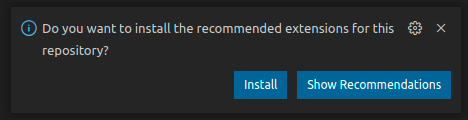
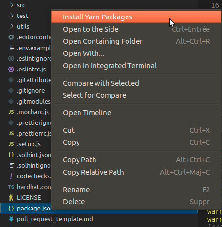

# Getting started

## Prerequisites

* [Node.js](https://nodejs.org/en/)

!!! important
    Sandbox smart contracts requires node v12.18.4 or later releases.

* [Yarn](https://yarnpkg.com/)

!!! important
    Sandbox smart contracts requires yarn v1.22.10 or later releases.

* [Visual Studio Code](https://code.visualstudio.com/)

There are two ways to install the project:

* [quick install](#quick-install) with the command line
* [install with Visual Studio Code](#install-with-visual-studio-code)

!!! tip
    Visual Studio Code is not required but facilitate the development and running the tests.

## Quick install

### Clone the repository

Firstly, clone the project from [github](https://github.com/thesandboxgame/sandbox-smart-contracts)

```shell
git clone git@github.com:thesandboxgame/sandbox-smart-contracts.git
```

!!! note
    We recommend [using ssh](https://docs.github.com/en/github/authenticating-to-github/connecting-to-github-with-ssh) to clone the project

### Install the dependencies

[Yarn](https://yarnpkg.com/) is a package manager for Node.js (like npm). In order to intall the dependencies, you simply run

```shell
yarn
```

## Install with Visual Studio Code

### Download & install Visual Studio Code
First, you need to [download](https://code.visualstudio.com/download) & [install](https://code.visualstudio.com/learn/get-started/basics) Visual Studio Code.

### Clone the repository

Launch Visual Studio Code and on the getting started page, click on "Clone Get Repository" and paste the git repository url
```shell
git@github.com:thesandboxgame/sandbox-smart-contracts.git
```

### Open the project

There are two ways to open the project.
The first one , within Visual Studio Code, open the folder `File > Open folder` containing the repository.

The second one is to open it from a terminal.
!!! tip "Opening the repository in a terminal"
    ```shell
    code /path/to/the/repository/sandbox-smart-contracts
    ```

### Install Visual Studio Code extensions

The first time you open the project, Visual Studio Code suggests you to install recommended extensions, click install

!!! Tip "Install the recommended extensions"
    

It will install these extensions:

* [ESLint](https://marketplace.visualstudio.com/items?itemName=dbaeumer.vscode-eslint)
* [EditorConfig for VS Code](https://marketplace.visualstudio.com/items?itemName=EditorConfig.EditorConfig)
* [Prettier - Code formatter](https://marketplace.visualstudio.com/items?itemName=esbenp.prettier-vscode)
* [Mocha Test Explorer](https://marketplace.visualstudio.com/items?itemName=hbenl.vscode-mocha-test-adapter)
* [solidity](https://marketplace.visualstudio.com/items?itemName=JuanBlanco.solidity)
* [yarn](https://marketplace.visualstudio.com/items?itemName=gamunu.vscode-yarn)

### Install the dependencies

On the left menu, select the `Explorer` tab, and at the root of the repository, you'll find the `package.json` file.
Right click on it and select `Install Yarn Packages`.

!!! Tip "Installing the packages"
    

You're ready to go! Let's try to [run the tests](running-tests.md).
