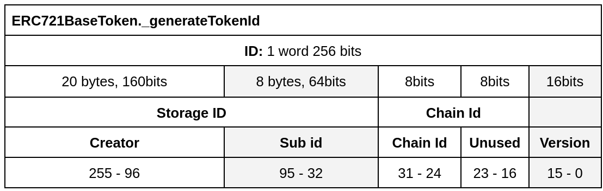

---
description: Estate
---

# Estate

## Introduction
Estate is an ERC-721 token, it can group ERC-721 Land tokens.

## Model

### Features of the contract

|              Feature | Link                                   |
| --------------------:|:-------------------------------------- |
|            `ERC-721` | https://eips.ethereum.org/EIPS/eip-721 |
|   `ERC-721 metadata` |                                        |
|            `ERC2771` | https://eips.ethereum.org/EIPS/eip-2771 |
|        `Upgradeable` | Yes                                     |
|             `Minter` | Yes                                     |
| `WithSuperOperators` | Yes?                                    |
|                      |                                         |

### Class diagram
```plantuml
title class diagram

class ERC2771ContextUpgradeable{}
class ContextUpgradeable{}
class Initializable{}
class BaseERC721Upgradeable{
    + batchTransferFrom(from, to, tokenIds)
    + safeBatchTransferFrom(from, to, tokenIds)
    + setTrustedForwarder(trustedForwarder)
    + exists(tokenId)
    + supportsInterface(interfaceId)
    +
}

class ERC2771ContextUpgradeable{}

class ERC721Upgradeable{}

class OZ:AccessControlUpgradeable{}

class EstateBaseToken{
    + initV1(trustedForwarder,admin,landToken_,chainIndex_,name_,symbol_)
    + create(landToAdd[][3])
    + mintEstate(to, tiles[])?
    + burnEstate(from, estateId)
    + setLandToken(landToken)
    + setBaseURI(baseUri)
    + getNextId()
    + getChainIndex()
    + getLandToken() 
    + getOwnerOfStorage(storageId)
    + getLandAt(estateId, offset, limit)
    + contain(uint256 estateId, MapLib.TranslateResult memory s)
    + getLandCount(uint256 estateId)
    + getTotalLandCount(address owner) 
    + getStorageId(uint256 estateId)
    + onERC721BatchReceived(operator, from, ids[], data) 
    + supportsInterface(interfaceId)
    
    
}

interface IEstateToken{}

class EstateTokenV1{
    + update(oldId, landToAdd[][3], landToRemove[][3])
    + burnEstate(from, estateId)
    + contractURI()
}

class PolygonEstateTokenV1{
    + update(oldId, landToAdd[][3], expToUnlink[], landToRemove[][3])
    + burnEstate(from, estateId)
    + setRegistry(registry)
    + getRegistry()
    + contractURI()
}

ContextUpgradeable <|-- ERC2771ContextUpgradeable  
Initializable <|-- ERC2771ContextUpgradeable
ERC2771ContextUpgradeable <|-- BaseERC721Upgradeable 
ERC721Upgradeable <|-- BaseERC721Upgradeable 
AccessControlUpgradeable <|-- BaseERC721Upgradeable  
IEstateToken <|-- EstateBaseToken  
BaseERC721Upgradeable <|-- EstateBaseToken  
EstateBaseToken <|-- EstateTokenV1  
EstateBaseToken <|-- PolygonEstateTokenV1 


``` 

## Processes 

#### Preamble: Quads
Quads are a representation of a group of land. They were introduced in the Land contract as cheap way fro mintng and transfering lands. Each quad is characterized by it's size, and a pair of x and y coordinates. For more information about quads, refere to the Land contract documentation. 

### Token Id
Each ER721 is associated with an unique token Id, Estate tokens are a bit more especial, they can be updated, with the adition or removal of lands. The token id pattern follows the following table:


Storage Id is the immutable part of the token id, that isn't altered by updates. 
-subId The main id of the token, it never changes.
-chainIndex The index of the chain, 0: mainet, 1:polygon, etc

### Contract storage
```shell
        address landToken;
        uint128 nextId; 
        uint32 chainIndex;
        string baseUri;
        mapping(uint256 => Estate) estate;
        mapping(address => uint256) totalLands;
```
* landToken;
* nextId
* chainIndex
* baseUri
* mapping estate
* mapping totalLands

#### PolygonEstateTokenV1
On Polygon's version of Estate, we have a pointer to the EstateExperienceRegistry, a registry that tracks the links between lands and experieces through Estate. Refer to EstateExperienceRegistry's documentation to lear more about it.

#### Diamond proxy storage
EstateBaseToken adopts a diamond proxy approach to its storage
https://eips.ethereum.org/EIPS/eip-2535#:~:text=function%20diamondStorage()%20internal%20pure%20returns(DiamondStorage%20storage%20ds)%20%7B
```shell
function _s() internal pure returns (EstateBaseTokenStorage storage ds) {
        bytes32 storagePosition = keccak256("EstateBaseTokenStorage.EstateBaseTokenStorage");
        assembly {
            ds.slot := storagePosition
        }
    }
```    

### Estate creation
A landowner can create an estate, providing the set of quads to add. The group of lands has to be adjacent, in accordance to the method isAdjacent() from MapLib.

#### Input for estate creation:
```shell
    /// @param landToAdd[][0] size of quad to add;
    /// landToAdd[][1] x coord of quad to add;
    /// landToAdd[][2] y coord of quad to add  
    uint256[][3] calldata landToAdd 
```


### Update Estate

The update function can be used to add and remove lands from an estate, as long as the changes don't break the adjacency of the lands in the estate. Update has to impact the token id, this is a safety measure, to avoid users listing their token on marketplace, and then removing the token lands. During an update the previous token is burned, and a new one is minted. The storgage id part of the token is kept between updates. 

It is important to notice that if an update renders the estate token empty, the token will be burned.

#### Inputs for update:

##### L1, from EstateTokenV1
```shell
    /// @param oldId the estate id that will be updated
    /// @param landToAdd The set of quads(size, x, y) to add.
    /// @param landToRemove The set of quads(size, x, y) to remove.
        uint256 oldId,
        uint256[][3] calldata landToAdd,
        uint256[][3] calldata landToRemove
```

##### L2, from PolygonEstateTokenV1

```shell
    /// @param oldId the estate id that will be updated
    /// @param landToAdd The set of quads(size, x, y) to add.
    /// @param expToUnlink experiences to unlink
    /// @param landToRemove The set of quads(size, x, y) to remove.
        uint256 oldId,
        uint256[][3] calldata landToAdd,
        uint256[] calldata expToUnlink,
        uint256[][3] calldata landToRemove
    
```
