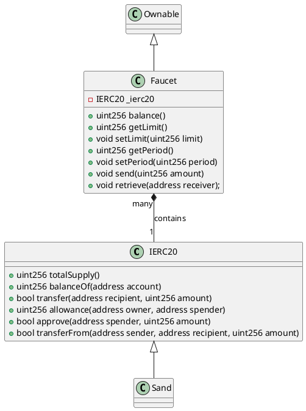
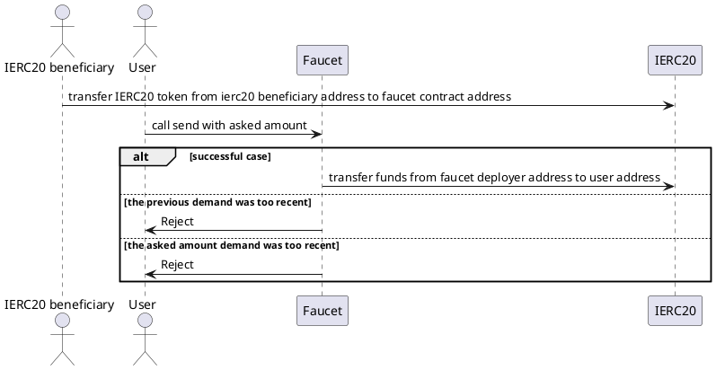
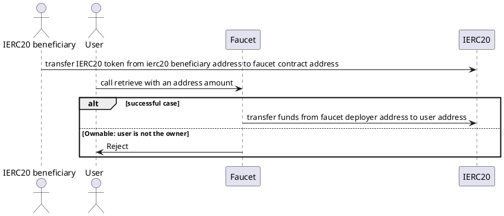

# [Faucet](https://github.com/thesandboxgame/sandbox-smart-contracts/blob/master/src/solc_0.8/faucet/Faucet.sol)

## Introduction

The purpose of this contract is to create faucet on ERC-20 token.
This contract makes it possible to distribute sand or any ERC20 token to any user who requests it.

## Model

This contract is dealing with sand (or any ERC20 token).  
[ERC20](https://ethereum.org/en/developers/docs/standards/tokens/erc-20/) is the classic standard to represent fungible token.

## Process

### Step 1

Sand admin or beneficiary transfer some sand from an address to the faucet contract address.

### Step 2

A user ask for an amount Sand (or ERC20 Token) through Faucet send method.

### Step 3

Faucet contract check that the asked amount is less that maximum amount authorized for a request.
If it is not the case the operation is reverted.

### Step 4

Faucet contract check that the time delta between each request for each user is much less than a parameter named period.
This period parameter is given as an argument of the constructor. If it is not the case the operation is reverted.

### Step 5

Faucet contract call transferFrom method of Sand (Erc20) contract with faucet deployer address, receiver address, and amount.
Amount is the minimun between balanceOf(deployer) and requested amount.

## Class diagram

## Sequence diagram

### Send

### Retrieve

