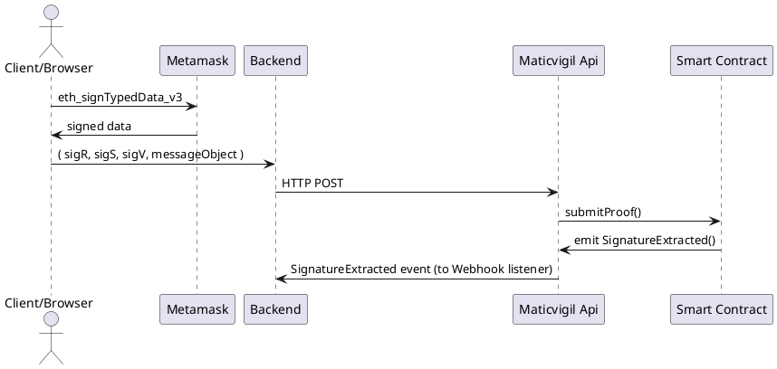

# [Our EIP712 Implementation](https://github.com/thesandboxgame/sandbox-smart-contracts/blob/master/src/solc_0.8/common/Base/TheSandbox712.sol)

## Description

This document describes our custom base implementation of an [EIP712](https://eips.ethereum.org/EIPS/eip-712) compatible smart contract.  
Signing data is a solved problem if all we care about are bytestrings.  
Unfortunately in the real world we care about complex meaningful messages.  
Hashing structured data is non-trivial and errors result in loss of the security properties of the system.  

Message is built in a standardized way starting with \x19 (EIP-712 implements EIP-191): 
It was first implemented by [Geth](https://github.com/ethereum/go-ethereum/pull/2940) 
```
"\x19Ethereum message to be signed" + length(message) + message 
``` 
In order to have a fixed length message we hash it: 
```
"\x19Ethereum message to be signed" + keccak256(message) 
```
Standard EIP-191 also recommanded to use byte version to:  
- x00: Data with “intended validator.” In the case of a contract, this can be the address of the contract.  
- 0x01: Structured data, as defined in EIP-712.  
- 0x45: Regular signed messages.  

The structure of hashed message must allow one thing : avoid domain and data structure collision.  
We need to be sure that our signed message will only me compatible with a specific domain smart contract with specific data format at a specific address.  
So in the message to sign we will have to include a DOMAIN_SEPARATOR that indicates the smart contract domain and its address.  
In our case it is given by: 
```
EIP712DOMAIN_TYPEHASH = keccak256("EIP712Domain(string name,string version,address verifyingContract)")  
```
and then 
```
DOMAIN_SEPARATOR = keccak256(EIP712DOMAIN_TYPEHASH + keccak256("The Sandbox") + keccak256("1") + address(this))  
```
Then come the TYPE_HASH that describe expected structure data.
Then we add parameters.

## Sequence diagram


