## Contract addresses

[Faucet contract on Goerli](https://goerli.etherscan.io/address/0xd910572C4801f4435a2098A55292270743105530)  
[Faucet contract on Rinkeby](https://rinkeby.etherscan.io/address/0x8e19Ca559eAB83a5201663E8a70cd0C2A9479663)  
[Faucet contract on Mumbai](https://mumbai.polygonscan.com/address/0x44DAAE71eF875d3B587206118E2Ff0071E315f43)   

## How to use Faucet on Goerli

### 1 Find contract on Goerli

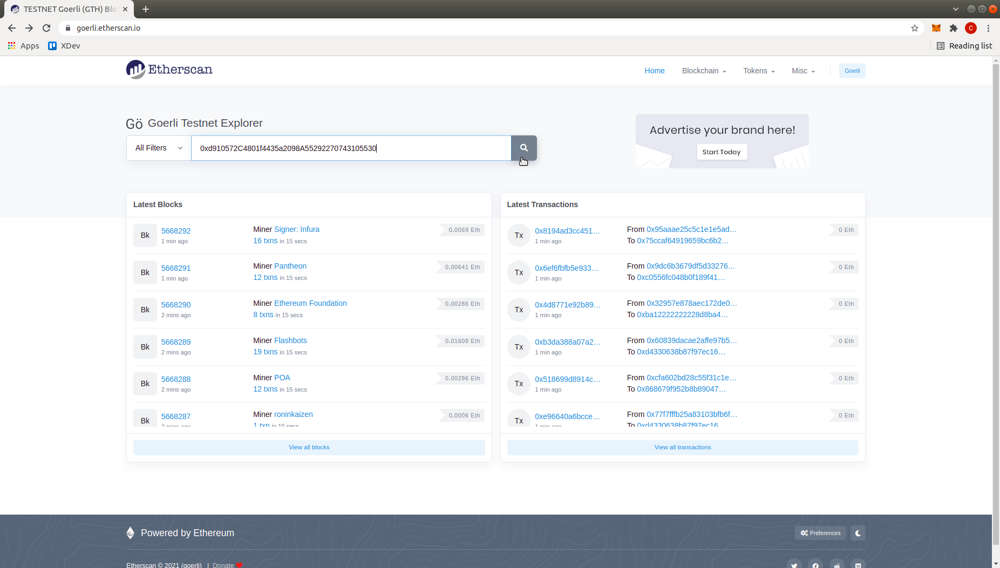

### 2 Access the contract

You can now see the contract with all its transactions.  
Click on the contract tab.

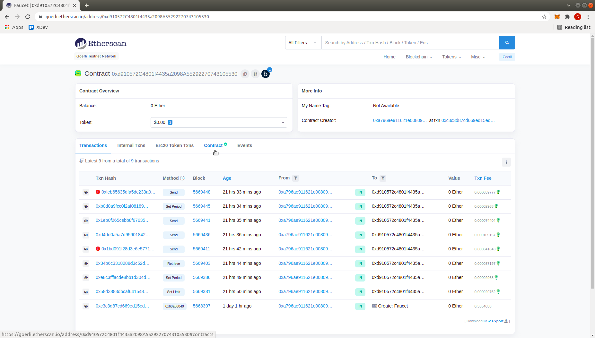

### 3 Go to the write section

Once on contract you can see the source code of the contract that has been validated.  
Go to the write section.  

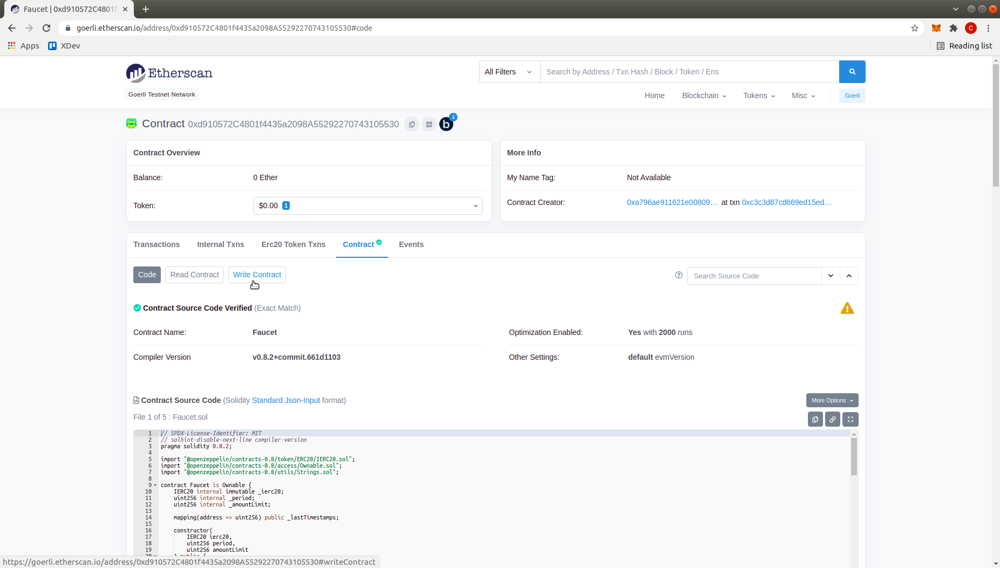

### 4 Connect with Metamask

In the write section you will find all callable methods on the contract.  
You will have to connect your Metamask wallet first.

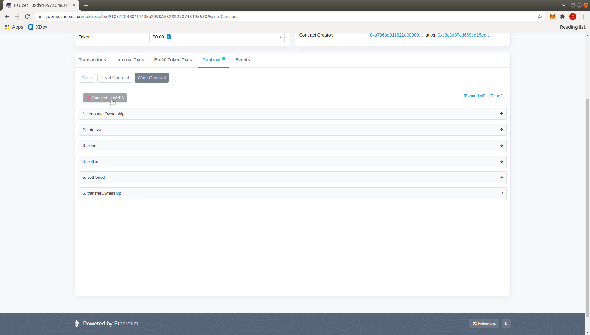

### 5 Select Metamask

A pop-up window opens and offers to connect your wallet.

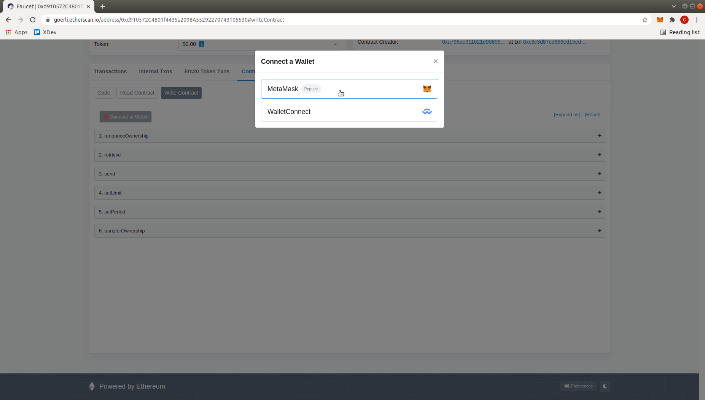

### 6 Connection.

You are now logged in with your Metamask wallet.  
Make sure the address is for the correct account.  
It appears on the button.  

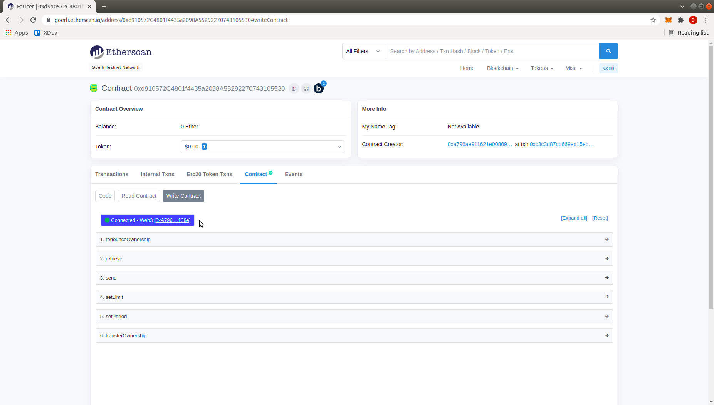

### 7 Get some Sand.

To obtain tokens you must enter the amount in the send part.  
Remember to multiply the amount by 10 ^ 18 because the amount is expressed in wei.

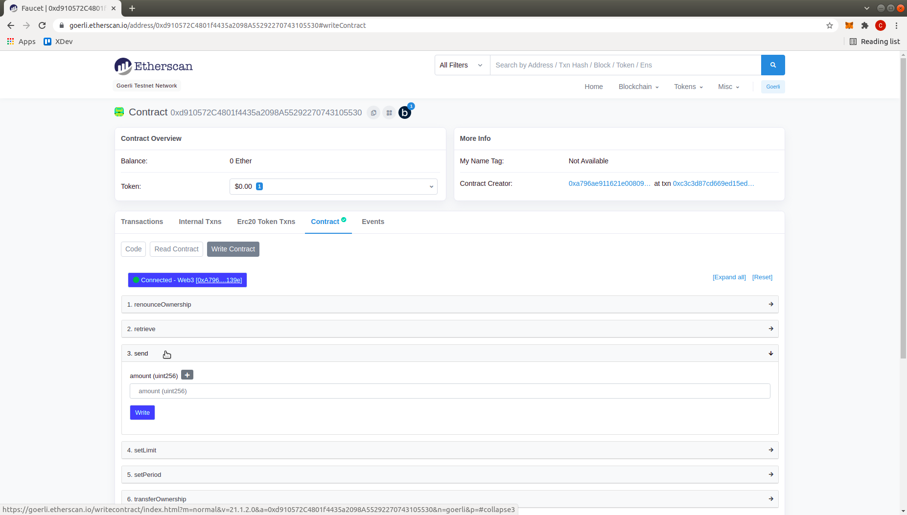

### 8 execute method.

Click on Write.

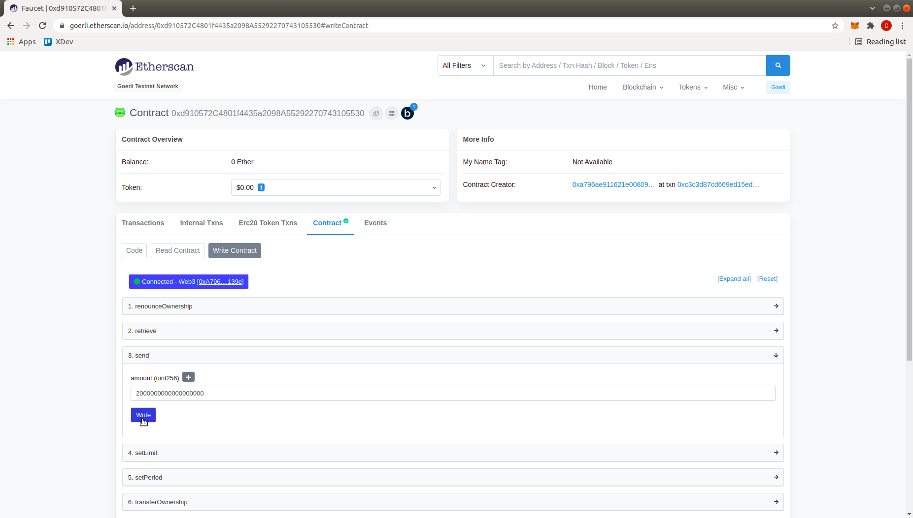

### 9 Sign the operation.

You will be asked to provide a signature with Metamask.

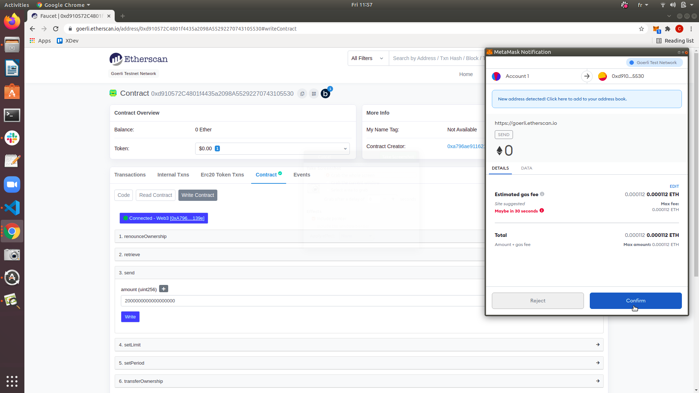

### 10 Wait for pending transaction.

Once the operation is executed you will receive a notification.  
By clicking on it you will be able to see the status of the transaction.  

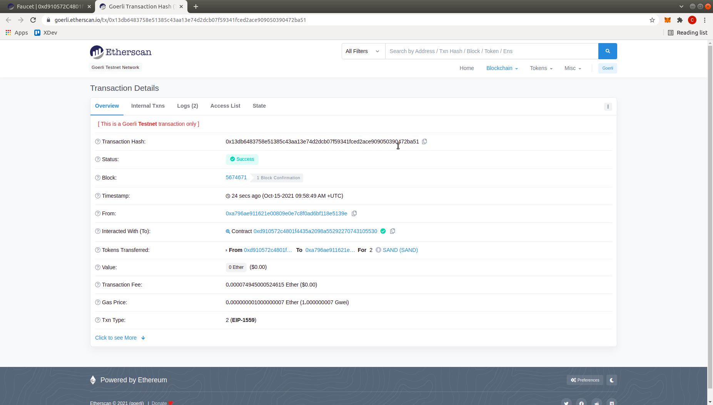

### 11 Get information on Faucet Contract.

If you want you can get information about the faucet contract in the reading section.
You will find the minimum time to wait between 2 calls on the contract:   
```  
getPeriod 
```   
You will also find the maximum amount you can claim on each call:    
```  
getLimit 
```   
The balance of the contract is visible thanks to:    
```  
balance 
```  
These settings can be changed only by the contract deployer.   
To do this, you must use the associated setters in the writing section.  

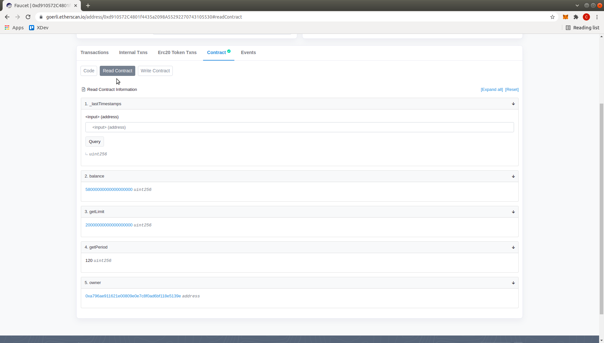

### 12 Retrieve all tokens from Faucet Contract.

The contract deployer will also be able to recover all the Sands from the contrat to any address using the retrieve method in the write section.  


