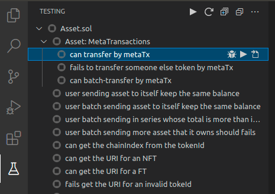

# Running the tests

There are two options to run the tests. The first one implies to use the command line whereas the second one uses Visual Studio Code.
Before running the tests, ensure to properly [install your environment](index.md).

## Running the tests from command line

Simply run the test with yarn in terminal
```shell
yarn test
```

## Running the tests with Visual Studio Code

Visual Studio Code uses the Mocha extension to run interactively the tests.
Select the tab `Testing` on the left and click the play button on top the menu.
You can decide to run a single test by selecting it and run it specifically.

!!! Tip "Running the tests"
    

!!! note "Learn more about Mocha"
    Learn more about [Mocha](https://mochajs.org) and [this extension](https://marketplace.visualstudio.com/items?itemName=hbenl.vscode-mocha-test-adapter)

Next step would be to [set your environment variables](setting-environment-variables.md) & subscribe to external services necessary to use different scripts.
