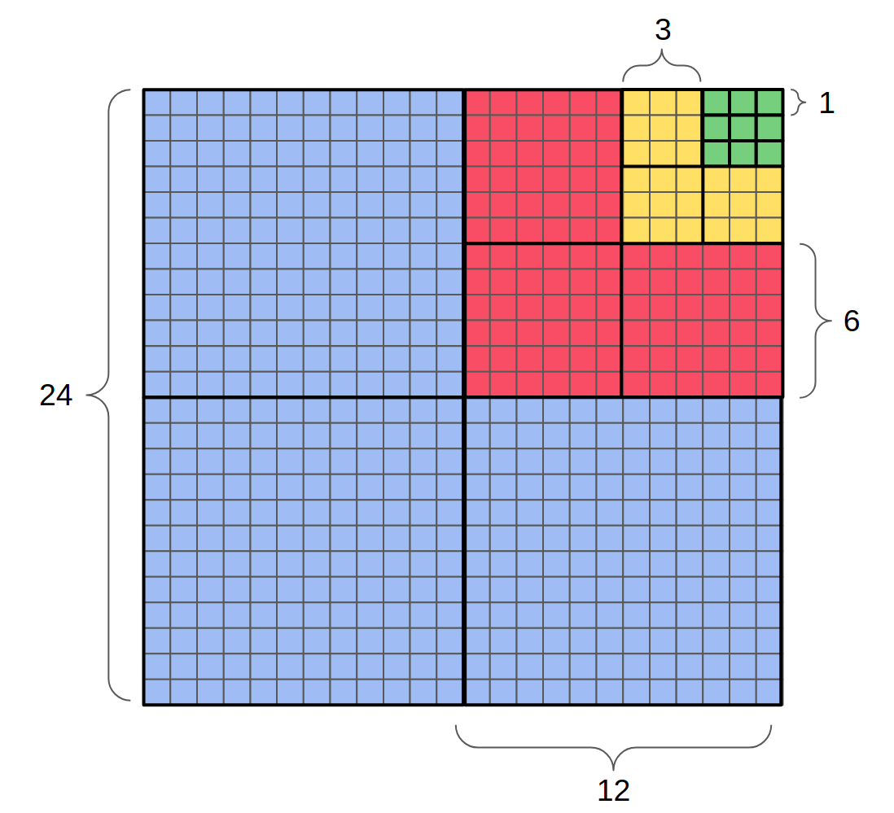
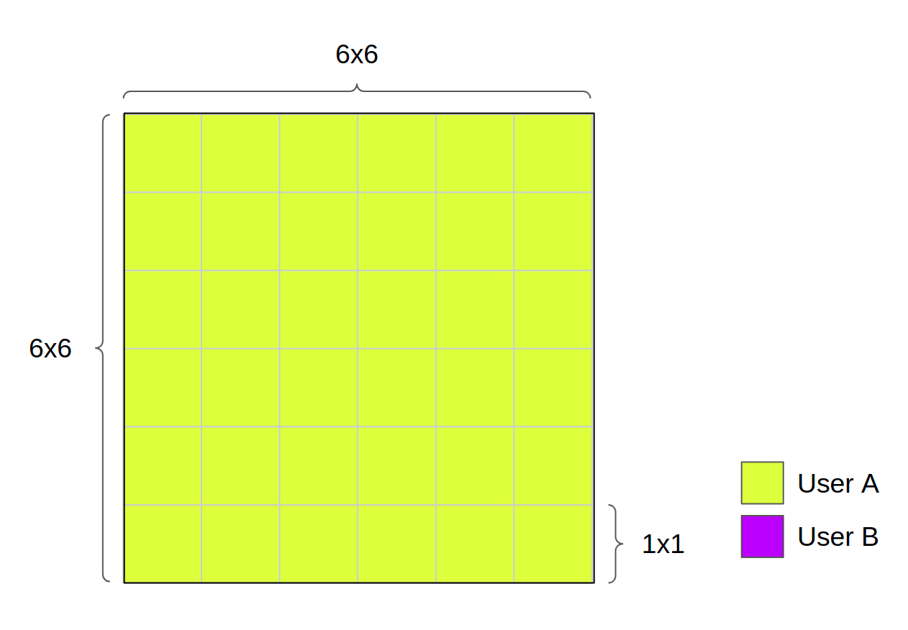
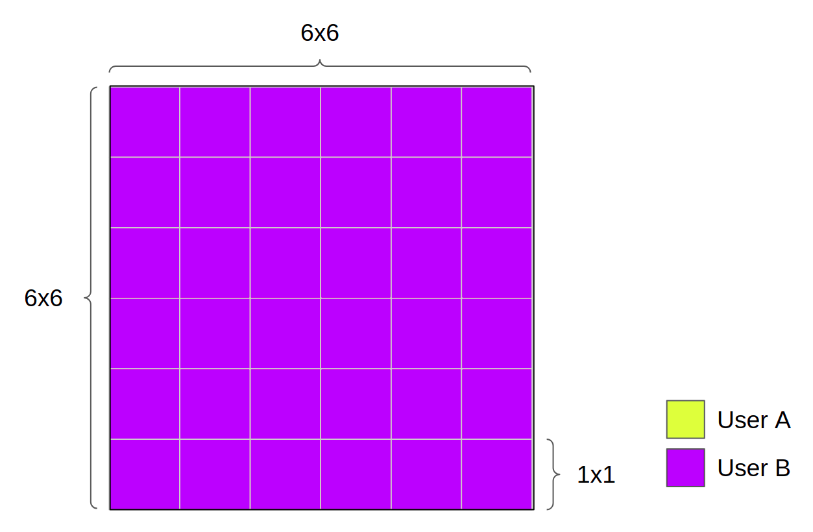
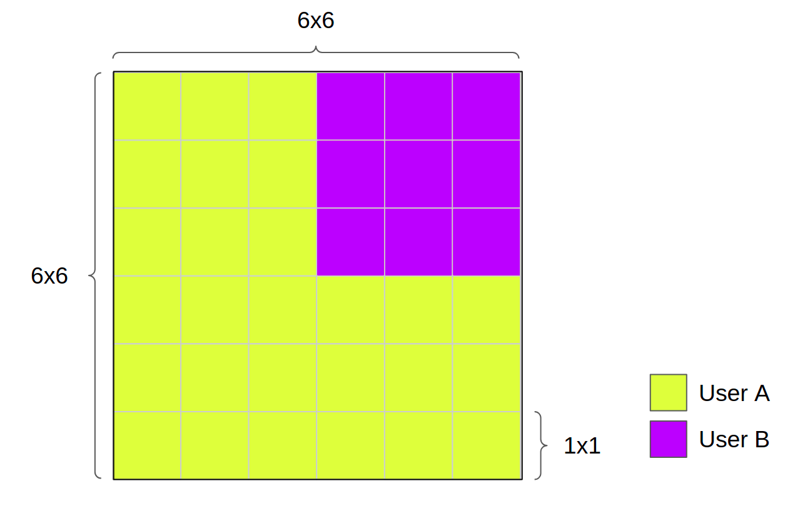
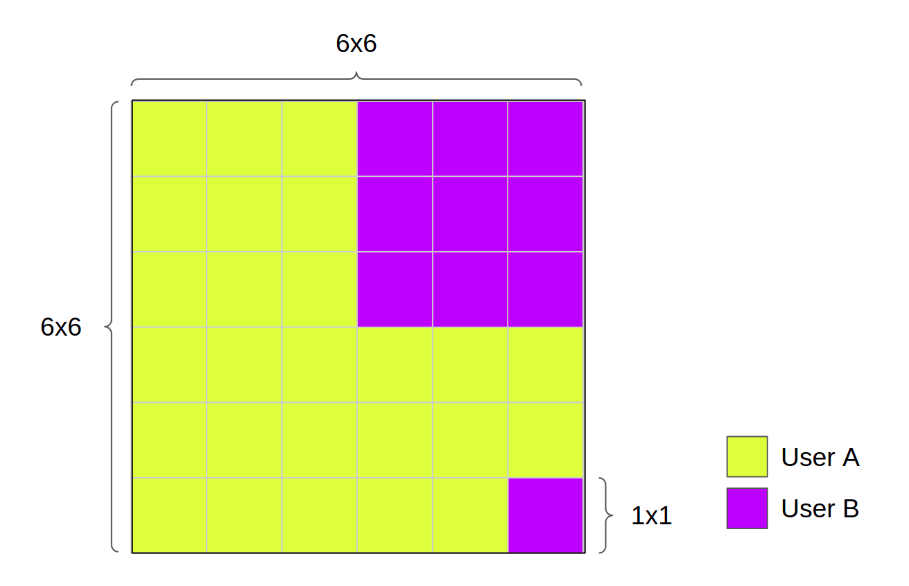
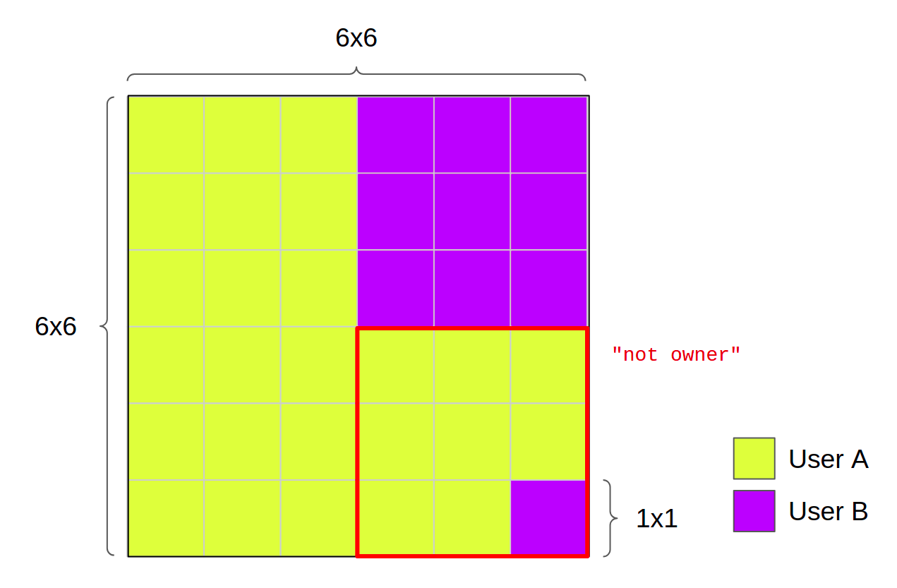

# Land

## Introduction

A [LAND](https://sandboxgame.gitbook.io/the-sandbox/land/what-is-land) is a digital piece of real-estate in The Sandbox's metaverse. Game designers use LAND to build digital experiences, such as games or dioramas, and also populate it with [ASSETs](../asset/asset.md).

Each LAND is a unique, non-fungible ERC-721 token on the Ethereum blockchain. A total of 166,464 LANDs are available.

Learn more about LAND in The Sandbox Metaverse in this [article](https://sandboxgame.gitbook.io/the-sandbox/land/what-is-land).

## Model

The Land token is an ERC721 token, in which the tokens represent pieces of the Sandbox world map. In total there are 166,464 LANDs, mapped to a 408x408 grid.

### Class diagram

```plantuml
title class diagram
class ERC721BaseToken {
    {field} + _numNFTPerAddress: mapping (address => uint256)
    {field} + _owners: mapping (uint256 => uint256)
    {field} + _operatorsForAll: mapping (address => mapping(address => bool))
    {field} + _operators: mapping (uint256 => address)

    + balanceOf(owner)
    + ownerOf(id)
    + approveFor(sender, operator, id)
    + approve(operator, id)
    + getApproved(id)
    + transferFrom(from, to, id)
    + safeTransferFrom(from, to, id)
    + batchTransferFrom(from, to, ids, data)
    + safeBatchTransferFrom(from, to, ids, data)
    + supportsInterface(id)
    + setApprovalForAllFor(sender,operator,approved)
    + setApprovalForAll(operator, approved)
    + isApprovedForAll(owner, operator)
    + burn(id)
    + burnFrom(from, id)


}

class LandBaseToken {
    {field} # _minters: mapping (address => bool)
    + setMinter(minter, enabled)
    + width( )
    + height( )
    + x(id)
    + y(id)
    + mintQuad(to, size, x, y, data)
    + transferQuad(from, to, size, x, y, data)
    + batchTransferQuad(from, to, sizes[], xs[], ys[], data)
}

class Land{
    + address metaTransactionContract
    + address admin
    + name(...)
    + symbol(...)
    + tokenURI(...)
    + supportsInterface(...)
}

interface ERC721Events{}

class SuperOperator{
    {field} # _superOperators: mapping (address => bool)
    + setSuperOperator(superOperator, enabled)
    + isSuperOperator(who)
}

class MetaTransactionReceiver{
    {field} # _metaTransactionContracts: mapping (address => bool)
    + isMetaTransactionProcessor(who)
}


ERC721Events <|-- ERC721BaseToken
SuperOperator <|-- ERC721BaseToken
MetaTransactionReceiver <|-- ERC721BaseToken
ERC721BaseToken <|-- LandBaseToken
LandBaseToken <|-- Land
```

### Features of the contract

|              Feature | Link                                                                                                                                                           |
| -------------------: | :------------------------------------------------------------------------------------------------------------------------------------------------------------- |
|            `ERC-721` | https://eips.ethereum.org/EIPS/eip-721                                                                                                                         |
|            `ERC2771` | [PRE-ERC2771](https://github.com/thesandboxgame/sandbox-smart-contracts/blob/master/src/solc_0.5/contracts_common/BaseWithStorage/MetaTransactionReceiver.sol) |
|        `Upgradeable` | No                                                                                                                                                             |
|             `Minter` | Yes                                                                                                                                                            |
| `WithSuperOperators` | Yes                                                                                                                                                            |
|                      |                                                                                                                                                                |

### Quads

What differentiates the Land contract from other ERC721 contracts, is the fact that lands are minted in quads. Quads are blocks of land, they are a way to represent groups of lands, quads are a low cost solution for minting multiple lands.

The contract supports following quad sizes:

- 24x24; 12x12; 6x6; 3x3; 1x1.

A 24x24 is composed of 4 12x12 quads, which are composed of 4 6x6 and so on, until 1x1 quads.



A quad in the SandBox's chart is recognized by its top left x and y coordiantes as well as its size.

It's important to notice that the users are oblivious of the existence of quads, for them they can only see the 1x1 pieces of land that belong to them.

### Token id pattern

ERC721 tokens always have an unique ID associated to them, in this Land contract the unique ID registered by the ERC721 contract is called `quadId`.

Quad IDs are calculated in two steps:

- First we calculate a base id: `uint256 id = x + y \* GRID_SIZE (408);`
- Then according to the size of the quad, we add a layer value, that will help us differentiate the quad ids by size.

!!! Info "Layer constants"
    ```solidity
    uint256 internal constant LAYER = 0xFF00000000000000000000000000000000000000000000000000000000000000;
    uint256 internal constant LAYER_1x1 = 0x0000000000000000000000000000000000000000000000000000000000000000;
    uint256 internal constant LAYER_3x3 = 0x0100000000000000000000000000000000000000000000000000000000000000;
    uint256 internal constant LAYER_6x6 = 0x0200000000000000000000000000000000000000000000000000000000000000;
    uint256 internal constant LAYER_12x12 = 0x0300000000000000000000000000000000000000000000000000000000000000;
    uint256 internal constant LAYER_24x24 = 0x0400000000000000000000000000000000000000000000000000000000000000;
    ```

The first layer is a mask to filter off quads bigger than 1x1.

#### Land id determination

`_idInPath` is a function that calculates the id for each land in the Sandbox grid, the function allow us to go through the lands in a quad and recover the id for each land.

#### Owner of land

`_ownerOf` overrides the ERC721BaseToken function, is the function retrieves the owner address for a 1x1 quad. It will start checking if the 1x1 token exists in the owners table, if it doesn't, it will check if the 1x1 quad is present in a bigger quad, 3x3, 6x6, 12x12 and 24x24.

### Regroup mechanism

The regroup mechanism is a series of functions that regroup smaller quads into bigger ones. The functions are the following:

- `_regroup24x24`: will scan the 24x24 quad in 12x12 ones, call `_regroup12x12` for each quad and update `_owners[id12x12]` to 0.
- `_regroup12x12`: Similar to `_regroup24x24`, it will scan the 12x12 quad in 6x6 ones, and update `_owners[id6x6]` to 0.
- `_regroup6x6`: will scan the 6x6 quad in 3x3 ones, call `_regroup3x3` for each quad and update `_owners[id3x3]` to 0.
- `_regroup3x3`: will go through all the path ids of the 3x3 quad, and call the `_checkAndClear` function, that will "clear" any independent 1x1 quads;
- `_regroup`: call the regroup function corresponding to the size of the quad being transferred.


## Processes

#### Illustrating how quads work

_This is not a user guide, users don't see quads, from their point of view they are only dealing with 1x1 lands_

Let's imagine we're minting a 6x6 quad for user A, in the coordinates 0, 0. We'll mint a single token, with an quad id calculated by:

!!! example "Minting 6x6 quad"
    ```solidity
        uint256 internal constant LAYER_6x6 =
        0x0200000000000000000000000000000000000000000000000000000000000000;
        uint256 quadId;
            uint256 id = x + y * GRID_SIZE;
            ...
            .. if (size == 6) {
                quadId = LAYER_6x6 + id;
    ```

There won't be 36 tokens minted, just one, with an id that allows us to access all it's internal quads.



User A can transfer his 6x6 quad to user B if he wants to, calling the `transferQuad` function.



In this 6x6 example, the quad can also be separated in 3x3 ones, and each 3x3 can be separated into 1x1 ones. The next image shows what would happens if a 3x3 quad would be transfered to user B.



It is also possible to transfer 1x1 quads.



Now, if we try to transfer the 3x3 from which we took one of the 1x1 quads, we'll get an error "not owner".



If the user A wants to send the rest of these lands, he would need to send the 1x1 quads one by one.


### Mint a quad

In order to mint multiple lands without the need of multiple transactions, lands are minted in quads. Only the minter can call the `mintQuad` function, upon it's call, it is necessary to inform

- `to`: who’s going to receive the land tokens,
- the `size` of the lands being minted,
- `x` and `y`
- and `data`: extra data to pass to the transfer.

The coordinates `x` and `y`, are the coordinates of the top left point of a quad, they must be multiples of the quad size and should respect the bounds of the land grid.

The function will then calculate a quadId, it starts with a base `x + y \* GRID_SIZE`.
The rest of the calculation depends on the size of the Lands being minted.

!!! example "quadId calculation"
    ```solidity
    if (size == 1) {
    quadId = id;
    } else if (size == 3) {
    quadId = LAYER_3x3 + id;
    } else if (size == 6) {
    quadId = LAYER_6x6 + id;
    } else if (size == 12) {
    quadId = LAYER_12x12 + id;
    } else if (size == 24) {
    quadId = LAYER_24x24 + id;
    } else {
    require(false, "Invalid size");
    }
    ```

Once we have the new quadId, we'll check if the lands inside this quad don't already exist. First by the following require:

!!! example "Already minted as 24x24 check"
    ```solidity
      require(_owners[LAYER_24x24 + (x/24) * 24 + ((y/24) * 24) * GRID_SIZE] == 0,
       "Already minted as 24x24");
    ```

The `(x/24) * 24` and ` (y/24) * 24` divisions will push the coordinates into the closest possible 24x24 quad.

For example, if we try to mint a 12x12 quad in the coordinates 12, 12, this require will check if a 24x24 quad starting in 0x0 doesn't already exist.

If we passed this first check we'll then continue verifying if the inner quads don't exist as well.

For 12, 6 and 3, the checks follow the same pattern:

- if the size of the new mint is smaller or equal the current size of the check (12, 6 or 3): check if the closest bigger quad was already minted.
- else : break the new quad in smaller ones, and go through the smaller quads to see if they were already minted.

For example:

For a 12x12 check, if the new quad is smaller than 12, the contract will do a similar check as we did for 24x24.

!!! example "Already minted as 12x12 check"
    ```solidity
      require( _owners[LAYER_12x12 + (x/12) * 12 + ((y/12) * 12) * GRID_SIZE] == 0,
       "Already minted as 12x12" );
    ```

This will check if our new quad doesn't belong to the closest 12x12 quad to the coordiantes `x` and `y`.

In the case of the new quad being bigger than 12x12, the contract will break the quad down into the possibles 12x12 quads, and verify if these were already minted.

!!! example "Breaking quad into 12x12 ones and verifying if ther were already minted"
    ```solidity
    for (uint256 x12i = x; x12i < (x + size); x12i += 12) {
                    for (uint256 y12i = y; y12i < (y + size); y12i += 12) {
                        uint256 id12x12 = LAYER_12x12 + x12i + y12i * GRID_SIZE;
                        require(_owners[id12x12] == 0, "Already minted as 12x12");
                    }
                }
    ```

Once these checks are done we'll go through all the land ids of this new quad and emit a `Transfer` event before updating the ownership table.

```plantuml

actor Miner
entity LandBaseToken

Miner -> LandBaseToken: mintQuad(to, size, x, y, data)


activate LandBaseToken
LandBaseToken -> LandBaseToken: Verify validity of size, x and y

LandBaseToken -> LandBaseToken: calculate quadId according to size
LandBaseToken -> LandBaseToken: check  if quad hasn't been minted before as 24x24

alt size <= 12
LandBaseToken -> LandBaseToken: check  if quad hasn't been minted before as 12x12
else
LandBaseToken -> LandBaseToken: break into 12x12 quads and check if those exist
end

alt size <= 6
LandBaseToken -> LandBaseToken: check  if quad hasn't been minted before as 6x6
else
LandBaseToken -> LandBaseToken: break into 6x6 quads and check if those exist
end

alt size <= 3
LandBaseToken -> LandBaseToken: check  if quad hasn't been minted before as 3x3
else
LandBaseToken -> LandBaseToken: break into 3x3 quads and check if those exist
end

loop size*size times
    LandBaseToken -> Miner: emit transfer(address(0), to, id)
end

LandBaseToken --> LandBaseToken: update ownership of this quad
deactivate LandBaseToken

```

### Transfer quad

Token owner or account authorized to make the transfer can call this function with the following parameters `from` current owner of the quad, `to` destination, `size` size of the quad, `x` top left x coordinate of the quad, `y` top left y coordinate of the quad and `data` any possible additional data.

Then, according to the quad size:

- size = 1; check the existence of quad as well its ownership and transfer if to new owner;
- size ≠ 1; we call the function regroup.

There are a couple of regroup functions, `_regroup3x3`, `_regroup6x6`, `_regroup12x12` and `_regroup24x24`, all according to the size of quad being transfered.

Each regroup function will break its quad into smaller ones, and call the size equivalent regroup function. For example, if we are transferring a 12x12 quad, the transfer function will call `_regroup12x12`, which will break the 12x12 quad into 4 6x6 ones, and call `_regroup6x6` for each of the 6x6 quads, in turn, `_regroup6x6` will break each 6x6 quad into 4 3x3 and call `_regroup3x3`.

regroup 3x3 is the smallest of the regroup functions, it goes through all the lands in the quad calling the function `_checkAndClear`. `_checkAndClear` will change the owner address of the internal 1x1 quads to zero if they are owned by `from`, which effectively regroups the quad.

Once all internal regroups are done and we are sure that the owner is the rightful owner of all lands, we update the `_owners[]` table.

```plantuml
actor Alice
entity LandBaseToken
Alice -> LandBaseToken: transferQuad(from, to, size, x, y, data)
activate LandBaseToken
alt size == 1
    LandBaseToken -> LandBaseToken: check validity and update owner's table
else else
    LandBaseToken -> LandBaseToken: Call regroup function
end
loop size*size times
    LandBaseToken -> Alice: emit transfer(from, to, id)
end
deactivate LandBaseToken
```

### Batch transfer quad

Same as transfer quad, but we'll need to pass an array of `sizes`, `x` and `y` coordinates to the function. The function will go through the arrays in a for loop, and execute `_transferQuad` for each one.

```plantuml
actor Alice
entity LandBaseToken
Alice -> LandBaseToken: transferQuad(from, to, sizes[], xs[], ys[], data)
activate LandBaseToken

loop sizes.length times
    LandBaseToken -> LandBaseToken: call function _transferQuad(from, to, size, xs[i], ys[i])
    LandBaseToken -> Alice: emit transfer(from, to, id)
    LandBaseToken -> LandBaseToken: calculate number of Tokens Transfered
end
    LandBaseToken -> LandBaseToken: update NFTs ownerships
deactivate LandBaseToken
```
