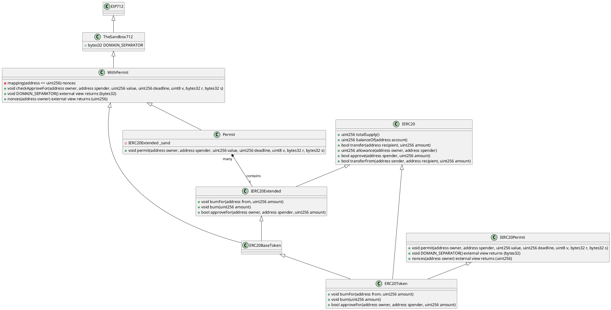
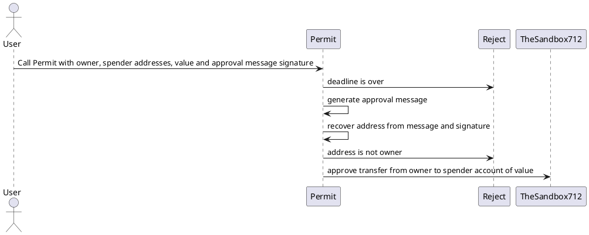

# [Permit](https://github.com/thesandboxgame/sandbox-smart-contracts/blob/master/src/solc_0.8/permit/Permit.sol)

## Introduction

The purpose of this contract is to allow transfer from an owner ERC-20 extended account to a spender one.

## Model

This contract is dealing with sand (an ERC20 extended).  
[ERC20](https://ethereum.org/en/developers/docs/standards/tokens/erc-20/) is the classic standard to represent fungible token.  
ERC20 extended only had the ability to burn (destroy) tokens.

## Process

### Step 1

We ensure that deadline authorization has not expired:  
Transfer authorization from the owner account on the spender account for EIP712 Token is only available until a certain limit date.

### Step 2

We build the digest message that was signed with the owner private key.

The digest message is built in a standardized way starting with \x19 (EIP-712 implements EIP-191):  
It was first implemented by [Geth](https://github.com/ethereum/go-ethereum/pull/2940)

```
"\x19Ethereum message to be signed" + length(message) + message
```

In order to have a fixed length message we hash it:

```
"\x19Ethereum message to be signed" + keccak256(message)
```

Standard EIP-191 also recommanded to use byte version to :

- x00: Data with “intended validator.” In the case of a contract, this can be the address of the contract.
- 0x01: Structured data, as defined in EIP-712.
- 0x45: Regular signed messages.

The structure of a hashed message must allow one thing: avoid domain and data structure collision.  
We need to be sure that our signed message will only me compatible with a specific domain smart contract with specific data format at a specific address.  
So in the message to sign we will have to include a DOMAIN_SEPARATOR that indicates the smart contract domain.  
In our case it is given by:

```
EIP712DOMAIN_TYPEHASH = keccak256("EIP712Domain(string name,string version,address verifyingContract)")
```

and then:

```
DOMAIN_SEPARATOR = keccak256(EIP712DOMAIN_TYPEHASH + keccak256("The Sandbox") + keccak256("1") + address(this))
```

The smart contract address is given by:

```
address(this)
```

Then come the TYPE_HASH that describes expected structure data:

```
PERMIT_TYPEHASH = keccak256("Permit(address owner,address spender,uint256 value,uint256 nonce,uint256 deadline)")
```

It is basically the signature of the contract method.  
Then we concatenate the transaction data itself : ie owner, spender, value, nonce, deadline

### Step 3

In elliptic cryptographie ECDSA (Elliptic Curve Digital Signature Algorithm)  
message signatures are made with two integers: r and s (32 bytes).  
[Ethereum](https://medium.com/mycrypto/the-magic-of-digital-signatures-on-ethereum-98fe184dc9c7) has added an additional recovery identifier variable called v.
So the signature computed is made of (v, r, s).

[ecrecover](https://soliditydeveloper.com/ecrecover) is a function that allow us to [recover address](https://crypto.stackexchange.com/questions/18105/how-does-recovering-the-public-key-from-an-ecdsa-signature-work) ( derived from a public key ) associated to the private key that signed a message.  
We must have both signature (v, r, s) and the original message that was signed with private key (in our case the message is digest).

v can either be 27 or 28.  
On elliptic curve multiple points can be computed from (r, s) alone.  
This would result in multiple public key computed from signed message.  
This is why we must have recovery identifier to select the right point and then the right address.

### Step 4

Once we recovered the address from the signature and digest, we must check that it is the owner address and exit overwise.

### Step 5

We now have the proof that the owner gave his agreement for a transfer on spender address (with given value).  
So we transmit this approval for erc20 extended contract.

## Class diagram



## Sequence diagram


