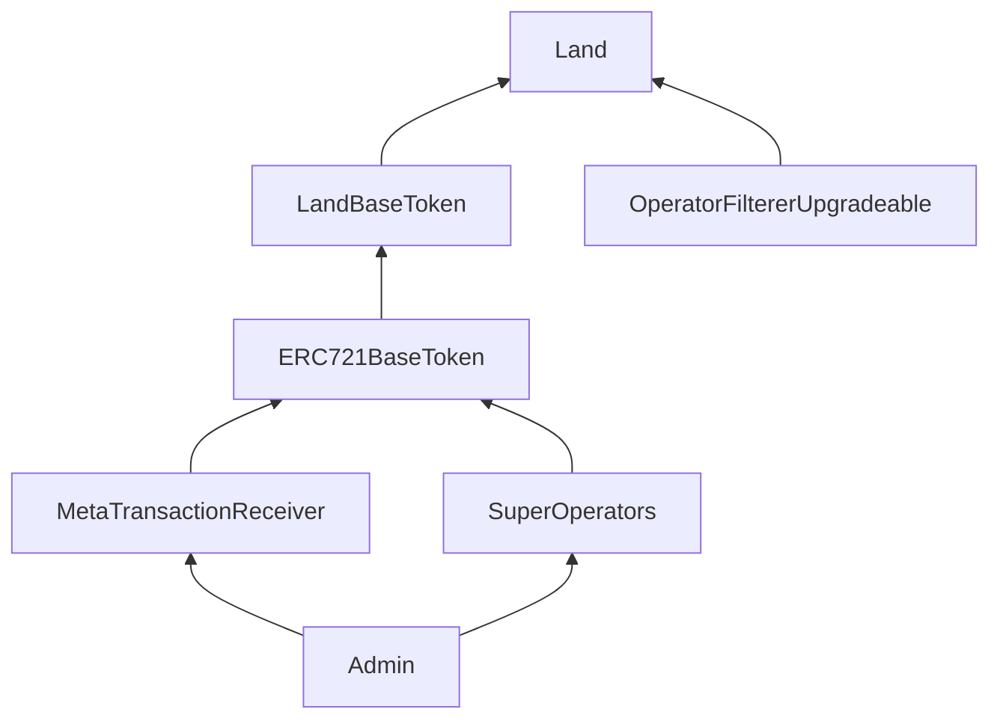
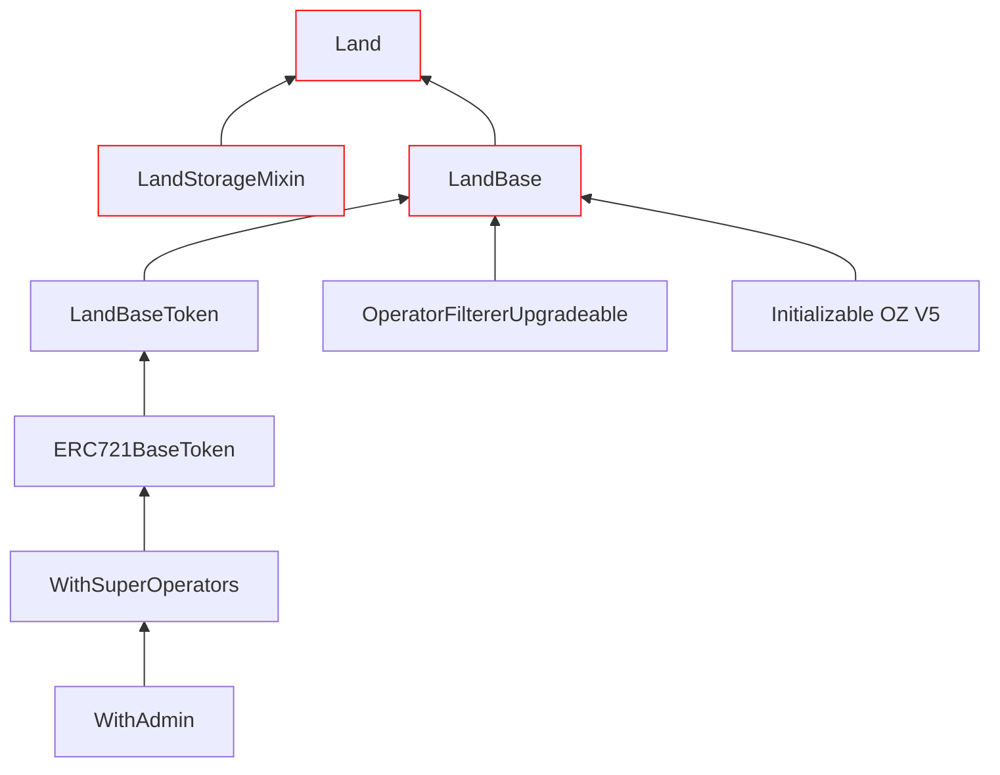
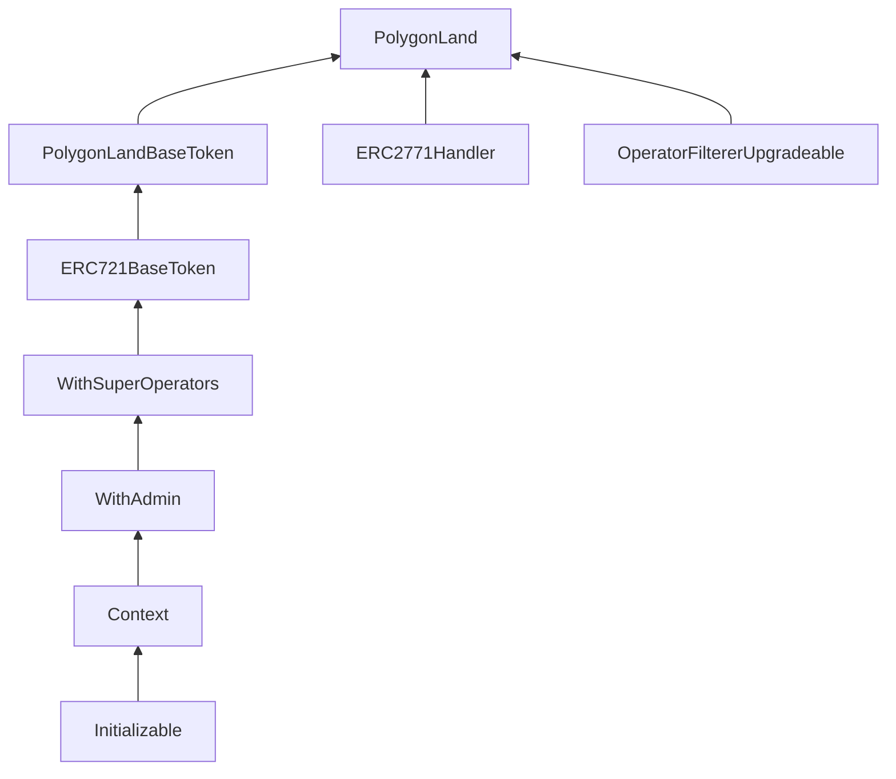
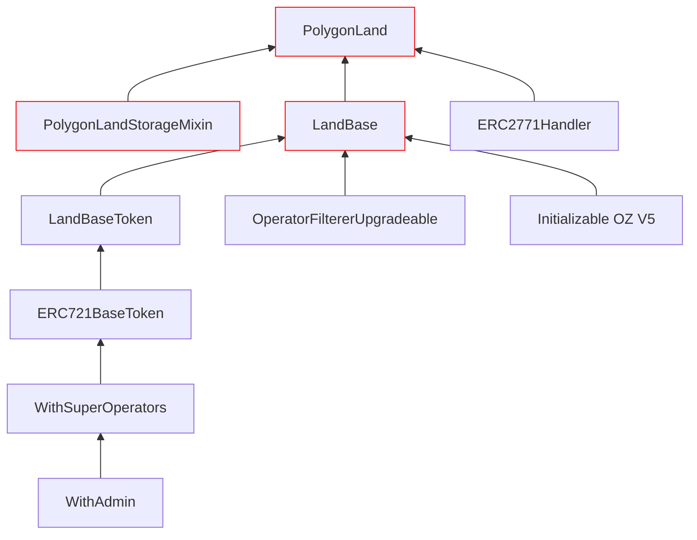

# Audience

The intended audience for .md documentation is auditors, internal developers and
external developer contributors.

We have two different contract deployed on Ethereum (L1) and Polygon (L2)

- [L1 Land](Land.md)
- [L2 Land](PolygonLand.md)

Both contracts are upgradable.

We decided to do an upgrade and create a shared base code for the two contracts.

To deal with the storage organization differences we added two mixins (one for
each contract).

Some observations:

- Initializable was implemented by hand in L1
- L1 land don't support TrustedForwarder (ERC2771)
- L2 land don't support MetaTransactionReceiver (ERC1776)
- We want to add the following new functionalities to both contracts: royalties
  support (EIP2981), owner (EIP173) and
  [metadata registry](./registry/LandRegistry.md) support.

# Inheritance structure comparison

- In each contract a Base class was added (LandBase, PolygonLandBase)
- All the classes below the Base class are abstract and keep the same
  functionality they used to have in the old implementation.
- Any access to variables is replaced by getters and setters to be implemented
  in each contract by the mixin.
- All the variables and the implementation of getters and setters where moved to
  Mixins
- There are two different mixins with different storage structures for each
  layer (LandStorageMixin, PolygonLandStorageMixin).

## Ethereum Land (L1) before

## Ethereum Land (L1) after

## Ethereum PolygonLand (L2) before

## Ethereum PolygonLand (L2) after

# Initializer

As the initializer code was different between the two contracts we decided to
leave unused the old variables and use the OpenZeppelin Initializer code.

To avoid any double call to the initializer we check the value of the `admin` to
be zero so:

- If the contract is used in a fresh deploy the initializer modifier protects it
  from being called twice.
- When we use the contract in the upgrade the admin value is already set so
  calling the initializer again will revert.
