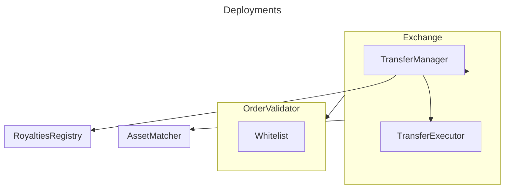

# Marketplace

The Sandbox allows its users to buy or sell assets (NFTs) through a dedicated marketplace directly on the website.

In that regard, this package enables an exchange of any kind of tokens (ERC20, ERC1155, ERC721) between two users. Each side of the exchange initializes an order to declare what he wants to buy or sell, signs it and the contract will try to match the two orders in order to execute the exchange.

In top of that, the protocol features:
- protocol fees for primary or secondary market
- royalties management through ERC2981
- custom royalties per collection and token
- primary or secondary market detection on collection implementing the UGC interface: when the creator of token sells his own token, the marketplace applies the primary market fees and skip the royalties
- meta transaction (ERC2771) support
- executing multiple exchange at once (batch matching orders)
- partial fills: an order can be partially completed after an exchange. For instance, an user is selling 20 tokens but a buyer only buy 5 of them. After this exchange, the order of the seller will be partially filled, and the signature of his order can be reused by another buyer
- whitelist of the payment tokens (ERC20)
- whitelist of the collections that can be traded
- EIP1776 support to be able to execute exchanges through an operator (SAND contract)

## Architecture

The protocol is divided into 5 main components:

Component | Description
---------|----------
 [Exchange](docs/exchange/Exchange.md) | The main entry point for the users to the protocol, handling the matching of orders and orchestration of the exchanges
 [OrderValidator](docs/exchange/OrderValidator.md) | This component handles the validation process of the orders based on theirs signatures and also checks the token whitelists
 [RoyaltiesRegistry](docs/royalties-registry/RoyaltiesRegistry.md) | This registry enables the support of multiple types of royalties (ERC2981, custom royalties per collection and token, external provider)
 Libraries | Compilation of helpers to handle orders, assets, transfers, royalties
 [TransferManager](docs/transfer-manager/TransferManager.md) | Manages the transfers of the payouts, fees & royalties

The protocol is deployed on 4 different addresses:
- Exchange
- OrderValidator
- AssetMatcher
- RoyaltiesRegistry



Also, the contracts use a set of libraries as helper.

Library | Description
---------|----------
 LibFill | Calculate the amount exchanged between 2 orders, and how orders are filled
 LibOrderDataGeneric | Help manipulating the data (payouts, fees) of an order
 LibAsset | Contains the structures, constants and hash functions related to an asset (ERC20, ERC1155, ERC721)
 BpLibrary | Base Point calculation library
 LibMath | Rounding calculation library
 LibOrder | Helpers to calculate EIP-712 hash, key hash, remaining fill of an order
 LibPart | Library for the parts receiving fees or royalties
 LibRoyalties2981 | Library for constants and functions related to ERC2891
 LibDeal | Define the structure that represents the data of each side of a deal (tokens, payouts)
 LibFeeSide | Helps defining which side of the exchange is paying for the fees

## Running the project locally

Install dependencies with
```shell
yarn
```

Testing inside `packages/marketplace` to run tests locally inside this package
```shell
yarn test
```

For testing from root (with workspace feature) use
```shell
yarn workspace @sandbox-smart-contracts/marketplace test
```

Run coverage
```shell
yarn coverage
```

Check formatting
```shell
yarn format
```

Fix formatting errors
```shell
yarn format:fix
```

Check linting
```shell
yarn lint
```

Fix static analysis errors
```shell
yarn lint:fix
```

## Package structure and minimum standards

#### A NOTE ON DEPENDENCIES

1. Add whatever dependencies you like inside your package; this template is for hardhat usage. OpenZeppelin contracts are highly recommended and should be installed as a dev dependency
2. For most Pull Requests there should be minimum changes to `yarn.lock` at root level
3. Changes to root-level dependencies are permissible, however they should not be downgraded
4. Take care to run `yarn` before pushing your changes
5. You shouldn't need to install dotenv since you won't be deploying inside this package (see below)

#### UNIT TESTING

1. Unit tests are to be added in `packages/marketplace/test`
2. Coverage must meet minimum requirements for CI to pass
3. `getSigners` return an array of addresses, the first one is the default `deployer` for contracts, under no circumstances should tests be written as `deployer`
4. It's permissible to create mock contracts at `packages/marketplace/contracts/mocks` e.g. for third-party contracts
5. Tests must not rely on any deploy scripts from the `deploy` package; your contracts must be deployed inside the test
   fixture. See `test/fixtures.ts`

# Deployment

Each package must unit-test the contracts by running everything inside the `hardhat node`. Deployment to "real" networks, configuration of our environment and integration tests must be done inside the `deploy` package.

The `deploy` package only imports `.sol` files. The idea is to recompile everything inside it and manage the entire deploy strategy from one place.

1. Your deploy scripts should not be included inside `packages/marketplace`: deploy scripts live inside `packages/deploy/`
2. The `deploy` package doesn't use the hardhat config file from the specific package. Instead, it
   uses `packages/deploy/hardhat.config.ts`
3. You will need to review `packages/deploy/hardhat.config.ts` and update it as needed for any new namedAccounts you added to your package
4. When it comes to deploy time, it is preferred to include deploy scripts and end-to-end tests as a separate PR
5. The named accounts inside the `deploy` package must use the "real-life" values
6. Refer to the readme at `packages/deploy` to learn more about importing your package

#### INTEGRATION TESTING

1. End-to-end tests live at `packages/deploy/`
2. You must add end-to-end tests ahead of deploying your package. Importantly, these tests should verify deployment and initialization configuration

# A NOTE ON MAKING PULL REQUESTS

1. Follow the PR template checklist
2. Your PR will not be approved if the above criteria are not met
