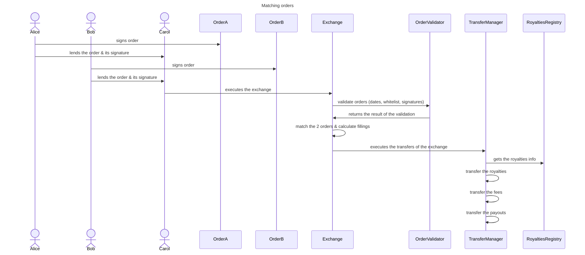
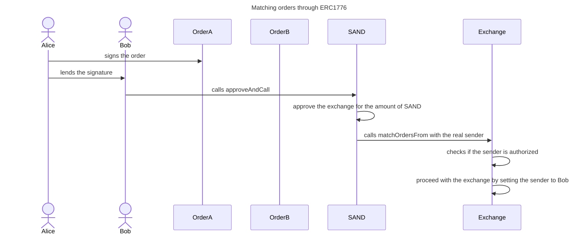

# Exchange

## Introduction

The [Exchange contract](../contracts/Exchange.sol) is the entrypoint and main
contract to the marketplace protocol. It safely offers a decentralized way to
exchange tokens of any nature (ERC20, ERC1155, ERC721) using signed orders.It
also supports exchanging bundles of assets, which can include multiple ERC20,
ERC1155, ERC721, and Quads.

## Concepts

### Order

An exchange consists of a trade between two parties. Each side of the trade is
called an order. That order contains all the information required to define what
a party is asking for. Let's consider this use case:

Order A

```
Alice wants to sell to anybody 1 LAND (ERC721) with token id 1000 against 100 SAND (ERC20).
```

The order represents this intent and includes the address of the seller, the
address of the NFT, the token id, the address of the ERC20 and the amount the
seller is asking for (and more).

### Bundle Order

In addition to single-asset orders, the protocol supports bundle orders, where
multiple assets are grouped together as a single entity for exchange. Let's
consider this use case:

Order B

```
Alice wants to sell a bundle of assets:
 1 LAND (ERC721) with token id 1000
  - Price: 1200 MATIC
 10 ASSET (ERC1155) with token id 2000
  - Price: 500 MATIC
 50 SAND (ERC20)
  - Price: 300 MATIC (6 MATIC per SAND)
against 2000 MATIC (ERC20).
```

The order represents this intent and includes the address of the seller, the
address for the tokens(ERC721 and ERC1155), the token ids, the individual prices
of the assets, the address of the ERC20 and the amount the seller is asking for.

### Maker & Taker

The maker and taker represent the 2 parties of the exchange. Each order can
define what should contain each party where the maker represents your side and
the taker the other side.

For instance, as a seller, I can decide to sell a NFT to anybody. But, I could
also specify that I only want to sell it to a particular user. In order to do
that, you have to input the taker address. Same reasoning, if I want to buy a
NFT but I don't mind which seller is selling me the NFT, all I have to do is
creating an order without a taker address. Otherwise, if I precisely want to buy
it from a seller, I can specify his address in the order.

### Matching

To execute a trade, you need two parties (and so 2 orders) that match. So, the
contract takes in 2 orders and check that both orders are actually a match and
satisfy each party. For instance, let's take again our seller use case:

`Order A`

```
Alice wants to sell to anybody 1 LAND (ERC721) with token id 1000 against 100 MATIC (ERC20).
```

An order satisfying `Order A` could simply be:

`Order B`

```
Bob wants to buy from anybody 1 LAND (ERC721) with token id 1000 against 100 MATIC (ERC20).
```

### Validation

In order to validate the maker of each order, the contract supports two ways to
validate an order:

- the sender of the transaction has to be the maker of the order
- the sender has to provide the
  [signature](https://eips.ethereum.org/EIPS/eip-712) of the order signed by the
  order's maker

It brings a powerful asynchronous system but also users should be careful when
signing an order because anybody can send a transaction to match 2 orders if
that user gets the signatures. For instance:

- Alice signs `Order A` and lends the signature to Carol
- Bob signs `Order B` and lends the signature to Carol
- Carol executes the trades with the 2 orders `Order A` and `Order B` and the 2
  signatures
- Alice & Bob must trust Carol

But you could save an action by not asking the signature for the `Order B`:

- Alice signs `Order A`
- Bob executes the trades with the 2 orders `Order A` and `Order B` but only the
  signature of the `Order A`

## Order filling

Filling is the process of matching the prices between two orders (left and
right) and deciding how much to transfer to each user accordingly. To represent
the prices each order has two fields:

1. The make side: the maximum the user is ready to give. For example less than
   `2000 SAND`.
2. The take side: the minimum the user wants to get. For example more than
   `4000 USDT`.

The minimum price the user accepts is the division between the take and the make
side, the lower bound for the price is `2 = 4000/2000 [USDT/SAND]`. An
equivalent way of expressing it is the inverse, if you divide make side by the
take side then you get an upper bound for the price:
`2000/4000 = 0.5 [SAND/USDT]`.

When comparing two orders the amount that the left side wants to make is
compared against the amount that the right side wants to take and vise versa. If
you consider the left side price as `take/make` then you must compare it against
inverse on the right side `make/take`. Because of that the equilibrium price
must be between the left side `take/make` and the right side `make/take` price.

For example:

`Order A`

```
Alice wants to sell to anybody 2000 SAND (make) against 4000 USDT (take).
The lower bound is 4000/2000 = 2 [USDT/SAND].
```

An order satisfying `Order A` could be:

`Order B`

```
Bob wants to buy from anybody 1000 SAND (take) against 3000 USDT (make).
The upper bound is 3000/1000 = 3 [USDT/SAND]
```

The equilibrium price must be anything between `2 [USDT/SAND]` and
`3 [USDT/SAND]`.

After deciding the equilibrium price, the quantity to transfer of each asset is
calculated. The marketplace supports partial filling, that is: respecting the
equilibrium price the amounts chosen are different from the ones that the user
asked initially.

For example: Let's consider `Order C` and `Order D`:

`Order C`

```
Alice wants to sell to anybody 10 ASSET (ERC1155) against 100 MATIC (ERC20) for each token.
```

`Order D`

```
Bob wants to buy from anybody 1 ASSET (ERC1155) against 100 MATIC (ERC20) for each token.
```

The equilibrium price is `100 [MATIC/ASSET]`, but, the selling order can't be
fully matched because the buyer can only buy 1 ASSET of 10. In that case, the
`Order C` is partially filled. `Order C` can be re-matched with another order in
a different transaction until being fully filled.

When choosing the equilibrium price some advantage can be given to one side or
the other. Let's consider `Order E` and `Order F`:

`Order E`

```
Alice wants to sell 8 ASSETs at 1000 MATIC for each.
Alice wants to get 8000 MATIC in total. The lower bound for the price is 1000 [MATIC/ASSET]
```

`Order F`

```
Bob wants to buy 6 ASSETs at 2000 MATIC each.
Bob is ready to spend 12000 MATIC for 6 ASSETs. The upper bound for the price is 2000 [MATIC/ASSET]
```

The equilibrium price must be between 1000 and 2000 MATIC for each ASSET.  
In the extreme cases:

- Equilibrium price 1000 MATIC/ASSET: Bob buys 8 ASSETS at 1000 MATIC each,
  Alice gets 8000 MATIC and sells everything, Bob buys partially. Both sides are
  happy and Bob has an extra benefit because he is paying 1000 MATIC instead of
  2000 MATIC each ASSET. Bob gets more assets than expected.
- Equilibrium price 2000 MATIC/ASSET: Bob buys 6 ASSETS at 2000 MATIC spending
  12000 MATIC and fully fill his order. Alice gets 12000 MATIC for 6 ASSETS
  filling partially his order. Both sides are happy, but, in this case Alice
  gets the benefit because she sells at 2000 MATIC each ASSET. Alice gets more
  MATIC than expected.

### Order salt

Orders contain a salt value that ensure each order is unique, even for the same
user and asset.

A user can decide to set the salt to 0 in its order. By doing so:

- that order can only be used by the maker
- the validation of the signature is also skipped
- the order can be reuse as many time as he wants
- and the partial filling is disabled

### Hash Key Order

An order is identified with a hash key composed of:

- the maker address
- the assets (type & contract address) being traded
- a salt

As you can see, the hash key doesn't include all the fields of the order,
meaning that 2 different orders with the same maker, assets and salt will have
the same hash key.

The consequences are multiple:

- since the filling is based on the hash key, different orders can share the
  same filling
- canceling an order means canceling all orders with the same hash key
- signing a new order with the same hash key than a former order will not
  invalidate the latter

### User-Generated Content (UGC) & Creator

UGC collection is a collection where the tokens are created by any user, and not
necessarily by the owner of the collection. The `creator` of a NFT represents
not the ownership of the token but the creation of the NFT which is essential to
distribute the royalties to the real creator. In a nutshell, UGC collections
need a royalty per token, not per collection. The protocol supports the
interface
[IRoyaltyUGC](../../dependency-royalty-management/contracts/interfaces/IRoyaltyUGC.sol)
to get the creator of a NFT during an exchange in order to apply different fee
value.

### Fees

The protocol permits to define a fee (%) applied to each exchange. That fee
usually covers the costs of running the marketplace. The value of the protocol
fee is determined according to nature of the exchange: primary or secondary
market. The notion of primary market means that the seller of the NFT is also
its creator. Note that the fees are applied only when a side of an exchange is
an ERC20 and another side is a NFT (ERC721 or ERC1155). The fee is always taken
from the ERC20 side. The fees are sent to an address (called the `Fee Receiver`)
defined when deploying the contract.

For instance, the primary market fee is set at 2% whereas the secondary market
fee is set 5%.

Bob is the creator of the ASSET (ERC1155) with token id 1.

```
Bob sells 1 ASSET (ERC1155) with token id 1 to Alice for 100 SAND (ERC20)
Bob receives 98 SAND from Alice
Fee Receiver receives 2 SAND from Alice
Alice receives 1 ASSET (ERC1155) with token id 1
```

Carol is the creator of the ASSET (ERC1155) with token id 2.

```
Bob sells 1 ASSET (ERC1155) with token id 2 to Alice for 100 SAND (ERC20)
Bob receives 95 SAND from Alice
Fee Receiver receives 5 SAND from Alice
Alice receives 1 ASSET (ERC1155) with token id 1
```

If a collection doesn't support the interface `IRoyaltyUGC`, the secondary
market fee is always applied.

### Royalties

The royalties are the share returning to the creator (or owner) of the
collection or token after a sale. The protocol handles multiple types of
royalties (ERC2981, royalties registry, external provider). See the
[RoyaltiesRegistry](RoyaltiesRegistry.md) contract for more information.

### Royalties for Bundles

For bundle orders, royalties are calculated individually for each asset type
within the bundle. Here's how it works:

- ERC721: The royalty is calculated on the price of each individual ERC721 asset
  within the bundle. The royalty fee is then deducted from the price of that
  specific ERC721 asset.
- ERC1155: The royalty is calculated based on the asset price for each ERC1155
  token within the bundle. The royalty fee is then deducted from this asset
  price.
- Quads: The price of Quad within the bundle is determined by the combined price
  of all land in the Quad. The royalty is then calculated using the royalty
  fetched for the land token associated with the leftmost land in the Quad.

### Payouts

The payouts define what is due for each party of the exchange. For the buyer
order, the payout is the NFT while for the seller order, the payout is the ERC20
tokens.

## Features

### Matching an order

The main feature is obviously to execute an exchange by matching two orders.



### Canceling an order

An order can be cancelled by providing the identifier of that order (hash key)
and that order. A cancelled order is then considered fully filled (set to max
integer). An order with no salt cannot be cancelled.

### Batch matching orders

Multiple pair of orders can be matched through batching. Note that if a pair
cannot be matched or validated, the whole batch reverts.

### Meta Transactions

The contract supports the ERC2771 standard to enable meta transactions.

### Access Control

The protocol is secured with the Open Zeppelin access control component.

6 roles are defined:

- `DEFAULT_ADMIN_ROLE`: handle the roles & users and the technical settings
  (trusted forwarder, order validator contract addresses)
- `EXCHANGE_ADMIN_ROLE`: handle the business decisions of the marketplace, for
  instance defining the fees, the wallet receiving the fees or if the fees apply
- `ERC1776_OPERATOR_ROLE`: allow an operator to execute an exchange on behalf of
  a sender
- `PAUSER_ROLE`: allow to control the pausing of the contract
- `TSB_SELLER_ROLE` - allows bypassing primary market check for TSB owned seller
  accounts
- `FEE_WHITELIST_ROLE` - allows bypassing all fees for whitelisted accounts
  (seller side only)

### ERC1776

In order to support the former native meta transactions standard which is used
by the
[SAND contract](https://github.com/thesandboxgame/sandbox-smart-contracts/blob/master/packages/core/src/solc_0.8/common/BaseWithStorage/ERC20/extensions/ERC20BasicApproveExtension.sol#L15)
, the Exchange contract can be the receiver of ERC1776 meta transactions on the
function `matchOrdersFrom`. The latter is protected with the role
`ERC1776_OPERATOR_ROLE`.

In a nutshell, the protocol trusts an address to give it the real sender as
first argument during a call.



### Skipping fees

If a maker is granted the role `EXCHANGE_ADMIN_ROLE`, the fees and royalties are
skipped for that order.

### Whitelisting

The protocol offers to enable whitelists on:

- payment tokens (ERC20) that can be traded
- collections (ERC1155 and ERC721) that can be traded

See the [OrderValidator](OrderValidator.md) contract for more information.

### Upgradeable

The Exchange contract is using initializers & gaps to provide upgradability.

### Pausing

The contract can be paused for emergency measures by users granted the role
`PAUSER_ROLE`. No more orders can be matched or cancelled when paused.
