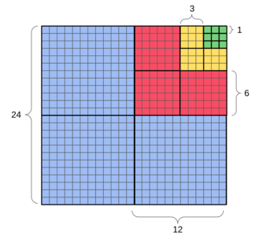
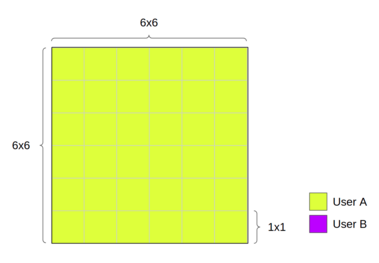
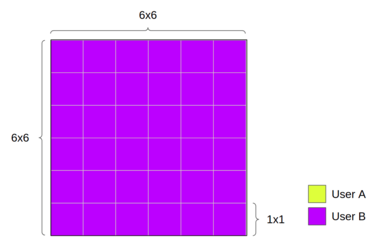
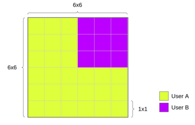
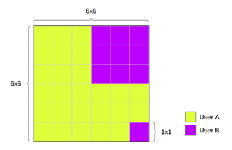
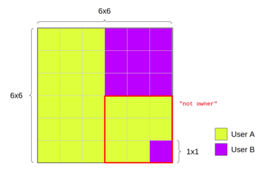
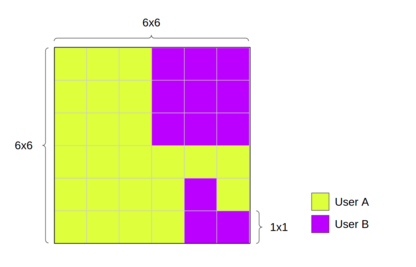

# Audience

The intended audience for .md documentation is auditors, internal developers and external developer contributors.

The Land contract implements the following standards:

- [ERC721](https://eips.ethereum.org/EIPS/eip-721)
- [ERC2771](https://eips.ethereum.org/EIPS/eip-2771)

check the standards for an explanation of concepts like tokenId, approval, minting, transfer, meta-transaction, etc.

# Features

A [LAND](https://sandboxgame.gitbook.io/the-sandbox/land/what-is-land) is a digital piece of real-estate in The
Sandbox's metaverse. Each LAND is a unique piece of the metaverse map which is a grid of 408x408 lands.

Instead of using sequential tokenIds the tokenId value is used to store the following information:

- the coordinates `(x,y)` of the land inside the map.
- the `layerId` that related to the size of [quads](#quads) (explained bellow).

Land exists on ethereum (L1) and polygon (L2). There is a Land contract for each network and also a land tunnel based on
the matic fx-portal library that can be used to transfer lands back and forth between the two networks.

In the V1 of the contract lands can only be minted on L1, V2 adds the possibility to mint on L2 too. V3 implement the
OpenSea royalties blacklist.

## Roles

The land contract support the following roles:

- admin: a unique address that is the owner of the contract and can manage the other roles.
- minters: a list of addresses that can mint lands.
- super operators: a list of addresses that are automatically approved to transfer tokens between users.
- meta transaction processor: an address that can transfer lands in behalf of other users and used to implement
  meta-transactions. On the L2 contract this role is the ERC2771 meta transaction forwarder.

# Quads

Quads are a way to groups lands. A quad of lands can be minted and transferred in one step. The concept is related to
a [QuadTree](https://en.wikipedia.org/wiki/Quadtree) but it has it own specific implementation in the Land contract.

The full map of `408x408` lands is divided in a grid of `17x17` quads that has a size of `24x24` each. Each `24x24`
quad is divided in four `12x12` quads, each `12x12` quad is divided in four `6x6` quads, each `6x6`
quad is divided in four `3x3` quads and each `3x3` quad is divided in nine `1x1` quads (or just lands). This way we have
a QuadTree. Each node is a ***quad*** and has one ***parent-quad*** and some ***child-quads*** that he includes.



A quad is recognized by its top left coordinate, top right coordinate and its size. Quads are part of a grid, so, the
coordinates of the quad must be a multiple of the quad size. For example: the coordinate `(6,0)` is valid for a `3x3`
quad and a `6x6` quad, but the coordinate `(3,0)` is only valid for a `3x3` quad.

***A quad of size `1x1` is just a land, and we will refer interchangeably to it as quad or land.***

## TokenId

The ERC721 tokenId is used to store the coordinates and size of quads. Instead of storing directly the size of the quad
a layerId is used to represent it. The formula for the quad information used is: `tokenId = ( x + y * 408 ) | layerId`.
Where

- `x,y` are the coordinates of the quad in the map and must be multiple of quad size.
- layerId depends on the size is one of:
  - `LAYER_1x1` = `0x0000000000000000000000000000000000000000000000000000000000000000`
  - `LAYER_3x3` = `0x0100000000000000000000000000000000000000000000000000000000000000`
  - `LAYER_6x6` = `0x0200000000000000000000000000000000000000000000000000000000000000`
  - `LAYER_12x12` = `0x0300000000000000000000000000000000000000000000000000000000000000`
  - `LAYER_24x24` = `0x0400000000000000000000000000000000000000000000000000000000000000`

Each land (a specific `x,y` coordinate) is included in five quads one for each layerId and each one of those quads has
its own tokenId. For example: the land `(0x123,0)` has the token id `0x123` and it is also included in the `3x3` quad
that has the tokenId `0x0100...0123`, etc.

***Using the tokenId of a quad a lot of lands can be minted or transferred in one transaction.***

## Ownership

The land contract uses a mapping called `_owners` that keep track of the ownership of quads and lands, it maps
the `tokenId` to the address of the owner, also the same mapping is used to store two flags. Here is the description of
the `_owners` mapping value:

- Bit 0-159 are used for the owner address
- Bit 160 is set when a land is burned, at the same time the owner address is set to zero.
- Bit 255 is used for the flag `operatorEnabled`. This flag is used to enable operators for a specific tokenId and is
  set during a call to approve. This flag is cleared automatically on transfer.

To decide if a user is the owner of a quad there are a few things to take into account:

1. When a user owns only part of the quad then the quad doesn't really belong to anybody, it belongs "to nobody".
2. We must represent quads that are not minted yet, they have "no owner".
3. Each land belongs to five quads (one for each layer) the contract choose which entry to set and which one to use to
   decide the right ownership of a land.

The contract keeps the consistency between the owners of quads, parent-quads and child-quads by using the following
rules:

- The ***address zero*** is used to represent both "nobody" and "no owner" which will be use interchangeably form now
  on.
- To be the owner of a quad the user must meet two conditions:
  - All the child-quads must be owned by him or must have "no owner".
  - If any of the child-quads belongs to "no owner" then the user must be the owner of the quad or some parent-quad.
    NOTE:
    if the user is the owner of all child-quads then automatically is the owner of the quad.
- When a user transfers a quad instead of setting the address of the user on all the child-quads the child-quads are set
  to "no owner" and the parent-quads are left untouched. This leave some parent-quads out of sync (some child can have a
  different owner). Even if this sounds wrong there is no way to abuse the situation because the owner of the
  parent-quad is not the owner of the child-quads anymore.
- When a user gets a new quad, and it fills a parent-quad the parent quad is left untouched and the user just owns the
  different pieces. If the user wants to unify the parent-quad he must do an extra transaction to transfer the
  parent-quad to himself.
- To mint a quad:
  - All child-quads must have "no owner".
  - All parent-quads must have "no owner".
  - Only one entry in the `_owners[tokenId]` mapping that corresponds to the tokenId of the quad is set to the address
    of the new owner. ***Only one storage slot is changed when minting.***

### Example

Let's imagine we're minting a 6x6 quad for user A, in the coordinates 0, 0. We'll mint a single token, with a quad id
equal to `LAYER_6x6`. There won't be 36 tokens minted, just one, with an id that allows us to access all its internal
quads.



User A can transfer his 6x6 quad to user B if he wants to, calling the `transferQuad` function.



The quad can also be separated in `3x3` ones and each `3x3` can be separated into `1x1` ones. The next image shows what
would happen if a `3x3` quad is transferred to user B. At this point user A lost the ownership of the `6x6` quad.



The same happen to the `3x3` quad when a `1x1` quad is transferred.



Now, if we try to transfer the `3x3` quad from which we took one of the lands, we will get the error "not owner".



If the user A wants to send the rest of these lands of the `3x3` quad, he must send them one by one.



# Methods

## Events info

### Minter event

```solidity
event Minter(address superOperator, bool enabled);
```

### MetaTransactionProcessor event

```solidity
event MetaTransactionProcessor(address metaTransactionProcessor, bool enabled);
```

### SuperOperator event

```solidity
event SuperOperator(address superOperator, bool enabled);
```

### AdminChanged event

```solidity
event AdminChanged(address oldAdmin, address newAdmin);
```

### Transfer event

```solidity
event Transfer(address indexed _from, address indexed _to, uint256 indexed _tokenId);
```

### Approval event

```solidity
event Approval(address indexed _owner, address indexed _approved, uint256 indexed _tokenId);
```

### ApprovalForAll event

```solidity
event ApprovalForAll(address indexed _owner, address indexed _operator, bool _approved);
```

## Functions info

### supportsInterface (0x01ffc9a7)

```solidity
function supportsInterface(bytes4 id) external pure returns (bool);
```

Check if the contract supports an interface 0x01ffc9a7 is ERC-165 0x80ac58cd is ERC-721 0x5b5e139f is ERC-721 metadata

Parameters:

| Name | Type   | Description             |
| :--- | :----- | :---------------------- |
| id   | bytes4 | The id of the interface |

### name (0x06fdde03)

```solidity
function name() external pure returns (string);
```

Return the name of the token contract

### getApproved (0x081812fc)

```solidity
function getApproved(uint256 id) external view returns (address);
```

Get the approved operator for a specific token

Parameters:

| Name | Type    | Description         |
| :--- | :------ | :------------------ |
| id   | uint256 | The id of the token |

### approve (0x095ea7b3)

```solidity
function approve(address operator, uint256 id) external;
```

Approve an operator to spend tokens on the sender behalf

Parameters:

| Name     | Type    | Description                        |
| :------- | :------ | :--------------------------------- |
| operator | address | The address receiving the approval |
| id       | uint256 | The id of the token                |

### height (0x0ef26743)

```solidity
function height() external pure returns (uint256);
```

total height of the map

### batchTransferFrom (0x15ddc535)

```solidity
function batchTransferFrom(address from, address to, uint256[] ids, bytes data) external;
```

Transfer many tokens between 2 addresses

Parameters:

| Name | Type      | Description                |
| :--- | :-------- | :------------------------- |
| from | address   | The sender of the token    |
| to   | address   | The recipient of the token |
| ids  | uint256[] | The ids of the tokens      |
| data | bytes     | additional data            |

### transferFrom (0x23b872dd)

```solidity
function transferFrom(address from, address to, uint256 id) external;
```

Transfer a token between 2 addresses

Parameters:

| Name | Type    | Description                |
| :--- | :------ | :------------------------- |
| from | address | The sender of the token    |
| to   | address | The recipient of the token |
| id   | uint256 | The id of the token        |

### safeBatchTransferFrom (0x28cfbd46)

```solidity
function safeBatchTransferFrom(address from, address to, uint256[] ids, bytes data) external;
```

Transfer many tokens between 2 addresses ensuring the receiving contract has a receiver method

Parameters:

| Name | Type      | Description                |
| :--- | :-------- | :------------------------- |
| from | address   | The sender of the token    |
| to   | address   | The recipient of the token |
| ids  | uint256[] | The ids of the tokens      |
| data | bytes     | additional data            |

### approveFor (0x2b991746)

```solidity
function approveFor(address sender, address operator, uint256 id) external;
```

Approve an operator to spend tokens on the sender behalf

Parameters:

| Name     | Type    | Description                        |
| :------- | :------ | :--------------------------------- |
| sender   | address | The address giving the approval    |
| operator | address | The address receiving the approval |
| id       | uint256 | The id of the token                |

### transferQuad (0x38bb305a)

```solidity
function transferQuad(
  address from,
  address to,
  uint256 size,
  uint256 x,
  uint256 y,
  bytes data
) external;
```

transfer one quad (aligned to a quad tree with size 3, 6, 12 or 24 only)

Parameters:

| Name | Type    | Description                           |
| :--- | :------ | :------------------------------------ |
| from | address | current owner of the quad             |
| to   | address | destination                           |
| size | uint256 | size of the quad                      |
| x    | uint256 | The top left x coordinate of the quad |
| y    | uint256 | The top left y coordinate of the quad |
| data | bytes   | additional data                       |

### safeTransferFrom (0x42842e0e)

```solidity
function safeTransferFrom(address from, address to, uint256 id) external;
```

Transfer a token between 2 addresses letting the receiver knows of the transfer

Parameters:

| Name | Type    | Description                |
| :--- | :------ | :------------------------- |
| from | address | The send of the token      |
| to   | address | The recipient of the token |
| id   | uint256 | The id of the token        |

### burn (0x42966c68)

```solidity
function burn(uint256 id) external;
```

Burns token `id`.

Parameters:

| Name | Type    | Description                |
| :--- | :------ | :------------------------- |
| id   | uint256 | token which will be burnt. |

### initialize (0x485cc955)

```solidity
function initialize(address metaTransactionContract, address admin) external;
```

### mintAndTransferQuad (0x4e6a0f44)

```solidity
function mintAndTransferQuad(address to, uint256 size, uint256 x, uint256 y, bytes data) external;
```

Checks if a parent quad has child quads already minted. Then mints the rest child quads and transfers the parent quad.
Should only be called by the tunnel.

Parameters:

| Name | Type    | Description                               |
| :--- | :------ | :---------------------------------------- |
| to   | address | The recipient of the new quad             |
| size | uint256 | The size of the new quad                  |
| x    | uint256 | The top left x coordinate of the new quad |
| y    | uint256 | The top left y coordinate of the new quad |
| data | bytes   | extra data to pass to the transfer        |

### exists (0x55064d85)

```solidity
function exists(uint256 size, uint256 x, uint256 y) external view returns (bool);
```

checks if Land has been minted or not

Parameters:

| Name | Type    | Description              |
| :--- | :------ | :----------------------- |
| size | uint256 | size of the              |
| x    | uint256 | x coordinate of the quad |
| y    | uint256 | y coordinate of the quad |

### ownerOf (0x6352211e)

```solidity
function ownerOf(uint256 id) external view returns (address owner);
```

Return the owner of a Land

Parameters:

| Name | Type    | Description        |
| :--- | :------ | :----------------- |
| id   | uint256 | The id of the Land |

### isSuperOperator (0x654b748a)

```solidity
function isSuperOperator(address who) external view returns (bool);
```

check whether address `who` is given superOperator rights.

Parameters:

| Name | Type    | Description           |
| :--- | :------ | :-------------------- |
| who  | address | The address to query. |

### mintQuad (0x6e1e3bbf)

```solidity
function mintQuad(address to, uint256 size, uint256 x, uint256 y, bytes data) external;
```

Mint a new quad (aligned to a quad tree with size 1, 3, 6, 12 or 24 only)

Parameters:

| Name | Type    | Description                               |
| :--- | :------ | :---------------------------------------- |
| to   | address | The recipient of the new quad             |
| size | uint256 | The size of the new quad                  |
| x    | uint256 | The top left x coordinate of the new quad |
| y    | uint256 | The top left y coordinate of the new quad |
| data | bytes   | extra data to pass to the transfer        |

### getAdmin (0x6e9960c3)

```solidity
function getAdmin() external view returns (address);
```

gives the current administrator of this contract.

### balanceOf (0x70a08231)

```solidity
function balanceOf(address owner) external view returns (uint256);
```

Return the number of Land owned by an address

Parameters:

| Name  | Type    | Description             |
| :---- | :------ | :---------------------- |
| owner | address | The address to look for |

### burnFrom (0x79cc6790)

```solidity
function burnFrom(address from, uint256 id) external;
```

Burn token`id` from `from`.

Parameters:

| Name | Type    | Description                         |
| :--- | :------ | :---------------------------------- |
| from | address | address whose token is to be burnt. |
| id   | uint256 | token which will be burnt.          |

### getY (0x845a4697)

```solidity
function getY(uint256 id) external pure returns (uint256);
```

y coordinate of Land token

Parameters:

| Name | Type    | Description |
| :--- | :------ | :---------- |
| id   | uint256 | tokenId     |

### _numNFTPerAddress (0x87826764)

```solidity
function _numNFTPerAddress(address) external view returns (uint256);
```

### setMetaTransactionProcessor (0x8a04af6a)

```solidity
function setMetaTransactionProcessor(address metaTransactionProcessor, bool enabled) external;
```

Enable or disable the ability of `metaTransactionProcessor` to perform meta-tx (metaTransactionProcessor rights).

Parameters:

| Name                     | Type    | Description                                                         |
| :----------------------- | :------ | :------------------------------------------------------------------ |
| metaTransactionProcessor | address | address that will be given/removed metaTransactionProcessor rights. |
| enabled                  | bool    | set whether the metaTransactionProcessor is enabled or disabled.    |

### getX (0x8e5cb5f6)

```solidity
function getX(uint256 id) external pure returns (uint256);
```

x coordinate of Land token

Parameters:

| Name | Type    | Description |
| :--- | :------ | :---------- |
| id   | uint256 | tokenId     |

### changeAdmin (0x8f283970)

```solidity
function changeAdmin(address newAdmin) external;
```

change the administrator to be `newAdmin`.

Parameters:

| Name     | Type    | Description                       |
| :------- | :------ | :-------------------------------- |
| newAdmin | address | address of the new administrator. |

### symbol (0x95d89b41)

```solidity
function symbol() external pure returns (string);
```

Return the symbol of the token contract

### _owners (0x992924a6)

```solidity
function _owners(uint256) external view returns (uint256);
```

### _operatorsForAll (0x9d786bbc)

```solidity
function _operatorsForAll(address, address) external view returns (bool);
```

### width (0x9ededf77)

```solidity
function width() external pure returns (uint256);
```

total width of the map

### setApprovalForAll (0xa22cb465)

```solidity
function setApprovalForAll(address operator, bool approved) external;
```

Set the approval for an operator to manage all the tokens of the sender

Parameters:

| Name     | Type    | Description                        |
| :------- | :------ | :--------------------------------- |
| operator | address | The address receiving the approval |
| approved | bool    | The determination of the approval  |

### isMinter (0xaa271e1a)

```solidity
function isMinter(address who) external view returns (bool);
```

check whether address `who` is given minter rights.

Parameters:

| Name | Type    | Description           |
| :--- | :------ | :-------------------- |
| who  | address | The address to query. |

### register (0xab01b469)

```solidity
function register(address subscriptionOrRegistrantToCopy, bool subscribe) external;
```

This function is used to register Land contract on the Operator Filterer Registry of Opensea.can only be called by admin.

used to register contract and subscribe to the subscriptionOrRegistrantToCopy's black list.

Parameters:

| Name                           | Type    | Description                                                       |
| :----------------------------- | :------ | :---------------------------------------------------------------- |
| subscriptionOrRegistrantToCopy | address | registration address of the list to subscribe.                    |
| subscribe                      | bool    | bool to signify subscription "true"" or to copy the list "false". |

### setSuperOperator (0xac9fe421)

```solidity
function setSuperOperator(address superOperator, bool enabled) external;
```

Enable or disable the ability of `superOperator` to transfer tokens of all (superOperator rights).

Parameters:

| Name          | Type    | Description                                             |
| :------------ | :------ | :------------------------------------------------------ |
| superOperator | address | address that will be given/removed superOperator right. |
| enabled       | bool    | set whether the superOperator is enabled or disabled.   |

### operatorFilterRegistry (0xb0ccc31e)

```solidity
function operatorFilterRegistry() external view returns (address);
```

### safeTransferFrom (0xb88d4fde)

```solidity
function safeTransferFrom(address from, address to, uint256 id, bytes data) external;
```

Transfer a token between 2 addresses letting the receiver knows of the transfer

Parameters:

| Name | Type    | Description                |
| :--- | :------ | :------------------------- |
| from | address | The sender of the token    |
| to   | address | The recipient of the token |
| id   | uint256 | The id of the token        |
| data | bytes   | Additional data            |

### _operators (0xb9b710e9)

```solidity
function _operators(uint256) external view returns (address);
```

### tokenURI (0xc87b56dd)

```solidity
function tokenURI(uint256 id) external view returns (string);
```

Return the URI of a specific token

Parameters:

| Name | Type    | Description         |
| :--- | :------ | :------------------ |
| id   | uint256 | The id of the token |

### setMinter (0xcf456ae7)

```solidity
function setMinter(address minter, bool enabled) external;
```

Enable or disable the ability of `minter` to mint tokens

Parameters:

| Name    | Type    | Description                                      |
| :------ | :------ | :----------------------------------------------- |
| minter  | address | address that will be given/removed minter right. |
| enabled | bool    | set whether the minter is enabled or disabled.   |

### isMetaTransactionProcessor (0xdc5074af)

```solidity
function isMetaTransactionProcessor(address who) external view returns (bool);
```

check whether address `who` is given meta-transaction execution rights.

Parameters:

| Name | Type    | Description           |
| :--- | :------ | :-------------------- |
| who  | address | The address to query. |

### isApprovedForAll (0xe985e9c5)

```solidity
function isApprovedForAll(address owner, address operator) external view returns (bool isOperator);
```

Check if the sender approved the operator

Parameters:

| Name     | Type    | Description                 |
| :------- | :------ | :-------------------------- |
| owner    | address | The address of the owner    |
| operator | address | The address of the operator |

### batchTransferQuad (0xeaa5e067)

```solidity
function batchTransferQuad(
  address from,
  address to,
  uint256[] sizes,
  uint256[] xs,
  uint256[] ys,
  bytes data
) external;
```

transfer multiple quad (aligned to a quad tree with size 3, 6, 12 or 24 only)

Parameters:

| Name  | Type      | Description                                  |
| :---- | :-------- | :------------------------------------------- |
| from  | address   | current owner of the quad                    |
| to    | address   | destination                                  |
| sizes | uint256[] | list of sizes for each quad                  |
| xs    | uint256[] | list of top left x coordinates for each quad |
| ys    | uint256[] | list of top left y coordinates for each quad |
| data  | bytes     | additional data                              |

### setApprovalForAllFor (0xeeb5a5d1)

```solidity
function setApprovalForAllFor(address sender, address operator, bool approved) external;
```

Set the approval for an operator to manage all the tokens of the sender

Parameters:

| Name     | Type    | Description                        |
| :------- | :------ | :--------------------------------- |
| sender   | address | The address giving the approval    |
| operator | address | The address receiving the approval |
| approved | bool    | The determination of the approval  |

# Links

- [LAND](https://sandboxgame.gitbook.io/the-sandbox/land/what-is-land)
